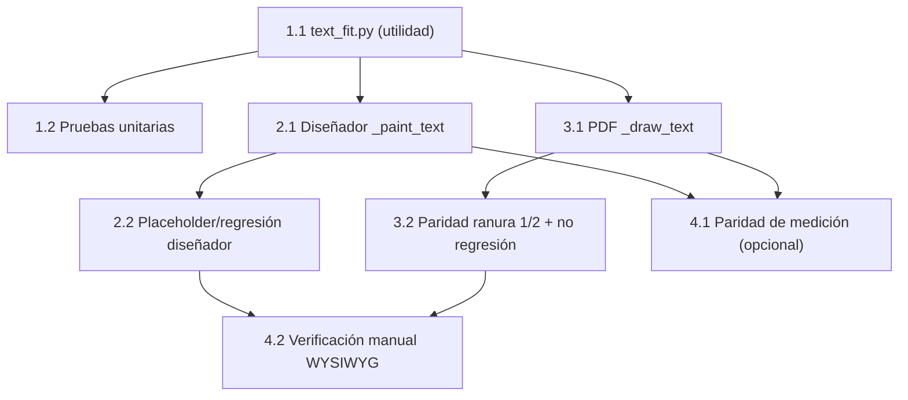

# Implementation Plan

## Overview

Plan de implementación para unificar el render de texto entre el diseñador (`GraphicElement._paint_text`, Qt) y la vista previa/impresión (`PDFEngine._draw_text`, ReportLab). Se introduce una utilidad compartida de ajuste y anclaje (`renderer/text_fit.py`) que ambos motores usan para calcular el tamaño de fuente efectivo (shrink-to-fit) y el punto de inicio del texto según la alineación, eliminando la dependencia del centrado automático de cada framework. El objetivo es que el texto coincida pixel a pixel en el diseñador y en la vista previa, en ranura 1 y ranura 2, sin importar la longitud del dato real.

## Tasks

- [x] 1. Crear la utilidad compartida de ajuste y anclaje de texto
- [x] 1.1 Implementar `fit_font_size` y los helpers de anclaje en `renderer/text_fit.py`
  - Crear `src/credencializacion/renderer/text_fit.py` con la función pura `fit_font_size(measure_width, text, box_width, base_font_size, min_font_size=1.0, padding=0.0)` que devuelve el mayor tamaño <= base que hace caber el texto en `box_width`, acotado por `min_font_size`
  - Implementar `compute_anchor_x(x, w, alignment)` → `left: x`, `center: x + w/2`, `right: x + w`, `justify: x`
  - Implementar `compute_start_x(anchor_x, text_width, alignment)` → `left: anchor_x`, `center: anchor_x - text_width/2`, `right: anchor_x - text_width`, `justify: anchor_x`
  - Mantener las funciones agnósticas del framework (sin importar Qt ni ReportLab)
  - _Requirements: 2.1, 2.2, 2.3_

- [x] 1.2 Escribir pruebas unitarias de la utilidad
  - Crear pruebas con un `measure_width` lineal simulado (ancho proporcional al tamaño) sin dependencias de Qt/ReportLab
  - Casos: texto que cabe → devuelve `base_font_size`; texto el doble de ancho → ~`base_font_size/2`; respeta `min_font_size`; `padding` reduce el ancho útil
  - Casos de anclaje: verificar `start_x` para `left`/`center`/`right`/`justify` con anchos conocidos
  - _Requirements: 2.1, 2.2, 2.3_

- [x] 2. Corregir el render de texto en el diseñador
- [x] 2.1 Reescribir `GraphicElement._paint_text` con anclaje explícito y shrink-to-fit
  - En `src/credencializacion/ui/widgets/canvas.py`, eliminar `Qt.TextFlag.TextWordWrap` y `Qt.AlignmentFlag.AlignCenter`
  - Resolver el texto priorizando `props["test_text"]`; si no existe, mantener el placeholder con el nombre del campo (con su fondo punteado de ayuda)
  - Calcular `effective_size` con `fit_font_size` usando `QFontMetricsF(font).horizontalAdvance` como `measure_width` y `box_width = self._rect.width()`
  - Calcular `anchor_x`/`start_x` con los helpers compartidos y `text_w` con `QFontMetricsF` a `effective_size`
  - Calcular el baseline vertical desde el centro de la caja usando ascent/descent de `QFontMetricsF` y dibujar con `painter.drawText(QPointF(start_x, baseline_y), texto)`
  - _Requirements: 2.1, 2.2, 2.3, 2.4_

- [x] 2.2 Preservar el fondo de ayuda solo en modo placeholder
  - Asegurar que el rectángulo punteado de ayuda se dibuje únicamente cuando se muestra el nombre del campo (sin `test_text`), no cuando hay dato real
  - Verificar que el texto `left` que ya cabe se siga dibujando con el tamaño definido por el usuario (sin reducción)
  - _Requirements: 3.2, 3.3_

- [x] 3. Corregir el render de texto en el motor PDF
- [x] 3.1 Reescribir `PDFEngine._draw_text` con anclaje explícito y shrink-to-fit
  - En `src/credencializacion/renderer/pdf_engine.py`, tras registrar la fuente, calcular `effective_size` con `fit_font_size` usando `pdfmetrics.stringWidth(text, registered_name, size)` como `measure_width` y `box_width = w`
  - Calcular `anchor_x`/`start_x` con los helpers compartidos y `text_w` con `pdfmetrics.stringWidth` a `effective_size`
  - Dibujar siempre con `canvas.drawString(start_x, baseline_y, text)` (dejar de usar `drawCentredString`/`drawRightString`)
  - Calcular `baseline_y` con `pdfmetrics.getAscentDescent(registered_name, effective_size)` desde el centro vertical de la caja, unificando el centrado vertical con el diseñador
  - _Requirements: 2.1, 2.2, 2.3, 2.4, 2.5_

- [x] 3.2 Confirmar que la corrección aplica idéntico en ranura 1 y ranura 2
  - Verificar que `_draw_text` no dependa del slot y que ambas ranuras reutilicen la misma rutina `_render_card → _render_element → _draw_text`
  - No modificar `_draw_image`, `_draw_shape`, `_draw_qr`, `_draw_barcode` ni el render de fondo
  - _Requirements: 2.5, 3.1, 3.4_

- [x] 4. Verificación de coincidencia diseñador vs vista previa
- [x] 4.1 Prueba de paridad de medición (integración, opcional)
  - Para la fuente registrada (Inter), comparar el `effective_size` calculado con `QFontMetricsF` y con `pdfmetrics.stringWidth` para el mismo texto/caja y confirmar que difieren por debajo de una tolerancia razonable
  - _Requirements: 2.4_

- [x] 4.2 Verificación manual WYSIWYG
  - Colocar un atributo `nombre` con alineación `center` y luego `right`; usar `test_text` corto ("Ana") y largo ("María Guadalupe de la Concepción")
  - Comparar el diseñador contra el PDF de `preview_template` con 2 registros reales, validando coincidencia de alineación y tamaño en ranura 1 y ranura 2
  - _Requirements: 2.1, 2.2, 2.3, 2.4, 2.5_

## Task Dependency Graph

```json
{
  "waves": [
    {
      "wave": 1,
      "tasks": ["1.1"],
      "description": "Utilidad compartida de ajuste y anclaje (prerrequisito de todo)"
    },
    {
      "wave": 2,
      "tasks": ["1.2", "2.1", "3.1"],
      "description": "Pruebas de la utilidad y cambios en ambos motores (paralelizables tras 1.1)"
    },
    {
      "wave": 3,
      "tasks": ["2.2", "3.2", "4.1"],
      "description": "Preservación/regresión por motor y paridad de medición"
    },
    {
      "wave": 4,
      "tasks": ["4.2"],
      "description": "Verificación manual WYSIWYG end-to-end"
    }
  ]
}
```



## Notes

- La utilidad `text_fit.py` (1.1) es prerrequisito de los cambios en ambos motores (2.1 y 3.1); conviene implementarla y probarla primero.
- Las tareas 2.x (diseñador) y 3.x (PDF) son independientes entre sí una vez lista la utilidad y pueden abordarse en paralelo.
- La tarea 4.1 es opcional: las métricas de QFontMetrics y ReportLab no son idénticas al píxel, pero al compartir algoritmo y fuente la coincidencia es visualmente equivalente.
- No se modifica el esquema JSON de los elementos; las plantillas guardadas siguen siendo compatibles.
- No tocar el render de foto/imagen, formas, QR, código de barras ni fondo (prevención de regresiones).
