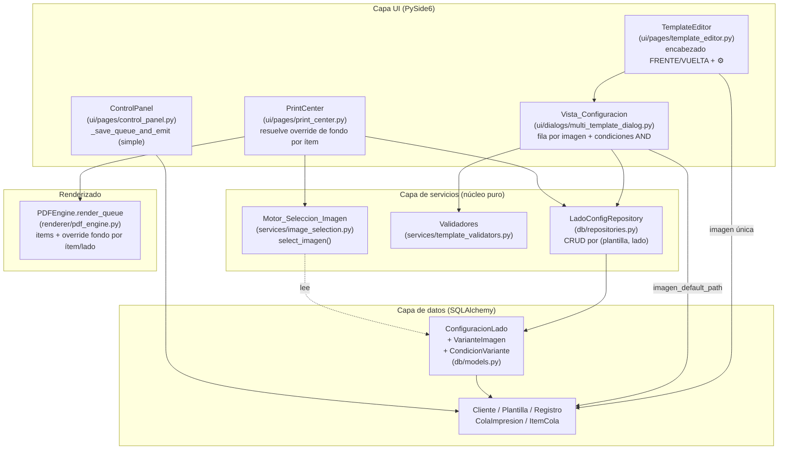
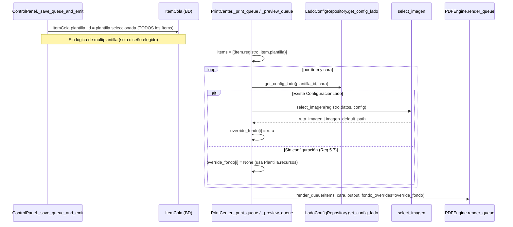
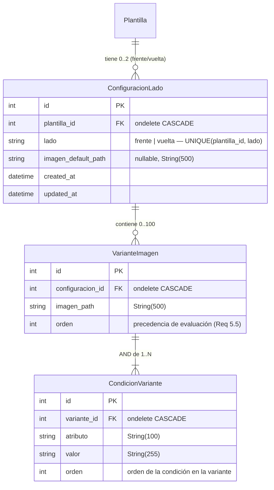

# Documento de Diseño — Multiplantillaje Base

## Overview

El **multiplantillaje base** permite que **un mismo diseño** (Plantilla) use **distintas imágenes de fondo** según los datos de cada registro, **sin crear diseños ni plantillas nuevas**. La configuración se define **por lado** del diseño: la clave es la combinación `(plantilla, lado)` con `lado ∈ {frente, vuelta}`, y existe **a lo sumo una** configuración por esa combinación. Un mismo diseño puede tener, por ejemplo, cinco variantes en el lado frente y una sola imagen (sin flujo de variantes) en el lado vuelta.

Una **Configuracion_Por_Lado** contiene una **Imagen_Base_Por_Defecto** (una ruta de imagen que se muestra en el diseñador y en la vista previa) más cero o más **Variantes**. Cada **Variante** combina una o más **Condiciones** del tipo "atributo igual a valor" en **conjunción lógica (Y)** —por ejemplo `grado == 1 Y grupo == "A"`— y mapea a **una ruta de imagen base** (`path`), no a un diseño. El resto del layout (textos, foto, QR, posiciones) se mantiene idéntico en todas las variantes: lo único que cambia es la imagen de fondo del lado.

### Cambio de modelo respecto a la versión anterior

Este diseño **reemplaza por completo** el modelo previo basado en "configuración por cliente" con reglas que apuntaban a una **plantilla destino** (un diseño). El modelo nuevo:

- La configuración ya **no es por cliente** sino **por `(plantilla, lado)`**.
- Las variantes guardan **rutas de imagen** (`path` dentro de `plantilla_base` del usuario), **no** referencias a `Plantilla`.
- El sistema **no crea Plantilla nuevas** al cargar varias imágenes base.
- En impresión, la multiplantilla **no cambia el `plantilla_id`** del `ItemCola`: solo sustituye la **imagen de fondo** por lado, registro a registro.

Se retiran del dominio los modelos `ConfiguracionMultiplantillaje`, `ReglaAsignacion` y `CondicionAsignacion`, sustituidos por `ConfiguracionLado`, `VarianteImagen` y `CondicionVariante`.

### Estado actual del flujo (punto de partida real en el repo)

- El editor (`ui/pages/template_editor.py`) ya abre un explorador con **selección múltiple** en `_select_base_image(side)`: con 1 imagen llama a `_apply_single_base_image`; con ≥2 invoca el (ahora obsoleto) `_create_designs_from_images`, que creaba diseños nuevos. **Ese camino de crear diseños se elimina** y se sustituye por abrir la Vista_Configuracion del lado.
- La imagen base por lado vive en `Plantilla.recursos["fondo_frente"|"fondo_vuelta"]`.
- El render (`renderer/pdf_engine.py`) toma el fondo de `Plantilla.recursos[fondo_lado]` tanto en `render` como en `render_queue`. `render_queue(items=[(registro, plantilla)], cara, output_path)` ya itera por ítem.
- `control_panel._save_queue_and_emit` crea un `ItemCola` por registro. En el modelo nuevo **todos los ítems reciben el `plantilla_id` seleccionado** (la multiplantilla no cambia de diseño); se elimina la resolución de `plantilla_id` por registro (`_resolve_plantilla_id`/`resolve_template`).
- El botón ⚙ (`_btn_config_frente`/`_btn_config_vuelta`) hoy se habilita solo con "plantilla guardada"; el bug a corregir es que **nunca llega a habilitarse de forma útil** porque no se conecta al estado real de existencia de `ConfiguracionLado` por lado.

### Decisiones de diseño

1. **Configuración por `(plantilla, lado)`** con `UNIQUE(plantilla_id, lado)`: una sola fila por diseño-lado (upsert). Permite que frente y vuelta del mismo diseño tengan configuraciones independientes.
2. **Variantes como rutas de imagen** (`String(500)`), no FK a `Plantilla`. No se generan diseños nuevos.
3. **Motor_Seleccion_Imagen como función pura** en `services/image_selection.py` (módulo nuevo, separado del legado `template_assignment.py`): recibe `datos` del registro y un `ConfigLadoDTO`, devuelve `str | None`. Determinista, sin Qt ni I/O.
4. **Override de fondo en el render con mínimo blast radius**: el `ItemCola` no cambia (solo guarda `plantilla_id`). La imagen elegida por `(registro, lado)` se resuelve **en el momento del render** en `print_center`, consultando `get_config_lado(plantilla_id, lado)` y `select_imagen(registro.datos, config)`, y se pasa a `pdf_engine.render_queue` como **override de fondo por ítem y lado**. `control_panel` queda sin lógica de multiplantilla.
5. **`imagen_default_path` se refleja en `Plantilla.recursos[fondo_lado]`** al guardar, para que el diseñador y la Vista_Previa existente muestren el fondo por defecto sin botones nuevos.
6. **Caso imagen única sin flujo**: si el usuario selecciona una sola imagen, se asigna directamente a `Plantilla.recursos` y **no** se crea `ConfiguracionLado` (la tabla solo se usa con ≥2 imágenes / variantes).

### Objetivos de diseño

- Conservar intacto el comportamiento cuando **no** existe `ConfiguracionLado` para el lado (Req 5.7, 7.2).
- Aislar la selección de imagen (`select_imagen`) como función pura testeable con PBT.
- Persistir la jerarquía `ConfiguracionLado → VarianteImagen → CondicionVariante` con integridad y cascadas.
- Integrar la creación de tablas a `init_database`/`create_all` sin romper datos; documentar la obsolescencia de las tablas viejas.
- Corregir bugs: tooltips legibles (contraste) y habilitación correcta del ⚙.

### Alcance

| Dentro de alcance | Fuera de alcance |
| --- | --- |
| Tablas `ConfiguracionLado` / `VarianteImagen` / `CondicionVariante` | Operadores distintos a la igualdad (rangos, regex) |
| Variantes con condiciones en conjunción (AND) | Disyunción (OR) dentro de una variante |
| Vista_Configuracion por lado (fila por imagen) | Crear diseños/plantillas nuevos |
| `select_imagen` (función pura, AND, primera coincidencia, fallback) | Cambios estructurales a `ItemCola` |
| Override de fondo por `(registro, lado)` en el render | Sincronización de configuración entre diseños/clientes |
| Migración: crear tablas nuevas, retirar las viejas | Backfill de datos productivos (no existen) |

---

## Architecture

### Vista de componentes



### Decisiones arquitectónicas y justificación

**1. Configuración por `(plantilla, lado)` con modelo dedicado.**
El fondo depende del diseño y del lado, no del cliente. `UNIQUE(plantilla_id, lado)` garantiza una única configuración por diseño-lado y permite frente/vuelta independientes. El `ondelete=CASCADE` desde `plantillas` limpia la configuración al borrar el diseño.

**2. `select_imagen` como función pura nueva (`services/image_selection.py`).**
Se crea un módulo separado en lugar de reescribir `template_assignment.py` para no arrastrar el modelo viejo (DTOs de reglas/plantilla destino). La función recibe `datos: dict` y un `ConfigLadoDTO` inmutable y devuelve la ruta de imagen (`str`) o `None`. 100% testeable con Hypothesis.

**3. Override de fondo en el render, no en `ItemCola` (mínimo blast radius).**
`ItemCola` solo guarda `plantilla_id`; **no se modifica su esquema**. La imagen elegida por `(registro, lado)` se calcula en `print_center` justo antes de renderizar (donde se conocen `registro`, `plantilla` y `cara`), llamando `get_config_lado(plantilla_id, cara)` y `select_imagen(registro.datos, config)`. Solo se cambia `pdf_engine.render_queue` para **aceptar un override de fondo por ítem**; el comportamiento sin configuración queda idéntico. Esta opción evita migrar `ItemCola`, evita materializar rutas en BD, y mantiene `control_panel` sin lógica de multiplantilla.

**4. Reflejar `imagen_default_path` en `Plantilla.recursos`.**
Al guardar la configuración, se escribe la imagen por defecto en `Plantilla.recursos[fondo_lado]`, de modo que el diseñador y la Vista_Previa existente la muestren sin agregar controles (Req 7.1).

### Flujo de configuración (encabezado → selección → Vista_Configuracion → persistencia)

```mermaid
flowchart TD
    A["Clic en encabezado FRENTE/VUELTA<br/>(_select_base_image)"] --> B["File dialog multi-selección<br/>(ya implementado)"]
    B --> C{¿Cuántas imágenes?}
    C -- "cancelar" --> Z["Sin cambios (Req 1.5)"]
    C -- "1 imagen" --> D["_apply_single_base_image:<br/>Plantilla.recursos[fondo_lado] = ruta<br/>NO crea ConfiguracionLado (Req 1.2, 9.2)"]
    C -- "≥2 imágenes" --> E["Abrir Vista_Configuracion del lado<br/>una fila por imagen (Req 1.3)<br/>sin paso de casillas"]
    E --> F["Por fila: Vista_Previa_Imagen<br/>+ condiciones AND (atributo/valor)<br/>+ marca imagen por defecto (Req 3)"]
    F --> CL{¿Cierra sin guardar?}
    CL -- "Sí" --> DISCARD["Descartar cambios (Req 9.5)<br/>config persistida intacta"]
    CL -- "No / Guardar" --> H{¿Validaciones OK?<br/>Req 3.8/3.9/3.10}
    H -- "No" --> F
    H -- "Sí" --> DIFF{¿Imágenes con<br/>orientación/dimensión<br/>distinta? (Req 9.4)}
    DIFF -- "Sí" --> WARN["Advertencia confirmar/cancelar"]
    DIFF -- "No / confirma" --> I["save_config_lado (UPSERT)<br/>única fila (plantilla, lado)<br/>reemplazo total de variantes/condiciones"]
    I --> REFLECT["Plantilla.recursos[fondo_lado] = imagen_default_path (Req 5.x/7.1)"]
    REFLECT --> J["Confirmación visible (Req 4.6)<br/>encabezado del lado inhabilitado (Req 1.4)<br/>⚙ del lado habilitado (Req 2.3)"]
    F -.botón Eliminar.-> K["delete_config_lado<br/>reactiva encabezado (Req 6.5)"]
```

### Flujo de impresión (override de fondo por registro y lado)



---

## Components and Interfaces

### 1. Capa de datos — `db/models.py`

Se **retiran** `ConfiguracionMultiplantillaje`, `ReglaAsignacion`, `CondicionAsignacion`. Se **añaden** `ConfiguracionLado`, `VarianteImagen`, `CondicionVariante` (detallados en Data Models). Se registran en `migrations.py` para que `create_all` los incluya.

### 2. Repositorio — `db/repositories.py`

`MultiTemplateRepository` se reemplaza por `LadoConfigRepository`, con CRUD por `(plantilla_id, lado)`:

- `get_config_lado(session, plantilla_id, lado) -> ConfigLadoDTO | None`
- `save_config_lado(session, plantilla_id, lado, variantes, imagen_default_path) -> ConfiguracionLado` (upsert in-place)
- `delete_config_lado(session, plantilla_id, lado) -> bool`
- `available_attributes(session, cliente_id) -> list[str]` (**se conserva** tal cual está hoy).

### 3. Motor de selección — `services/image_selection.py` (nuevo)

`select_imagen(datos, config) -> str | None`: función pura. Evalúa `config.variantes` en orden; una variante coincide solo si **todas** sus condiciones se cumplen (AND); primera coincidencia gana y devuelve su `imagen_path`; si ninguna coincide devuelve `config.imagen_default_path`. Reutiliza `normalize` (se mueve/duplica a este módulo para no depender del legado).

### 4. Validadores — `services/template_validators.py`

Se **conservan** y adaptan: `validate_atributo_length` (1..100), `validate_valor_length` (1..255), `validate_condiciones`, `detect_duplicate_pairs` / `is_duplicate_condition_set` (conjunto de condiciones por variante, Req 3.9), `validate_single_default` (Req 3.10, ahora sobre el conjunto de rutas de la config en vez de plantillas del cliente), y `detect_template_differences` → **renombrado conceptualmente a comparar imágenes** (`detect_image_differences`): opera sobre metadatos de imagen (orientación/dimensiones) en lugar de plantillas (Req 9.4).

### 5. UI — `ui/dialogs/multi_template_dialog.py` (Vista_Configuracion)

`MultiTemplateDialog(QDialog)` se reorienta a **una sola Vista_Configuracion por lado**:
- Recibe `(plantilla_id, cliente_id, lado, rutas_iniciales)`.
- **Una fila por imagen**: Vista_Previa_Imagen (miniatura; indicador "no disponible" si no carga, Req 3.2), editor de condiciones AND (agregar/quitar atributo+valor en la misma fila, Req 3.3/3.4), y un radio/checkbox exclusivo de **imagen por defecto** (Req 3.7).
- Acciones: reasignar ruta de una variante (Req 6.1), cambiar condiciones (Req 6.2), eliminar variante (Req 6.3), cargar más imágenes (Req 6.4), eliminar configuración completa (Req 6.5).
- Sin paso previo de casillas (Req 1.3). El selector de atributo se puebla de `available_attributes` (Req 8); permite entrada manual si no hay (Req 8.4).

### 6. UI — `ui/pages/template_editor.py`

- `_select_base_image(side)`: 1 imagen → `_apply_single_base_image` (actual); ≥2 → abrir Vista_Configuracion del lado con las rutas seleccionadas (sustituye `_create_designs_from_images`, que se elimina).
- `_update_config_buttons_state()`: por lado, consulta si existe `ConfiguracionLado(plantilla_id, lado)` y entonces **inhabilita el clic del encabezado** y **habilita el ⚙** de ese lado; el ⚙ requiere además plantilla guardada (Req 1.4, 2.3, 2.4). Esto corrige el bug de habilitación.
- Tooltips: se añade un estilo global `QToolTip` con contraste (Req 2.7) en el arranque de la app/estilos.

### 7. Flujo — `ui/pages/control_panel.py`

`_save_queue_and_emit` se **simplifica**: todos los `ItemCola` reciben el `plantilla_id` seleccionado. Se eliminan `get_config`/`resolve_template`/`_resolve_plantilla_id` (modelo viejo).

### 8. Render — `renderer/pdf_engine.py`

`render_queue` acepta un parámetro opcional `fondo_overrides: list[str | None] | None` alineado a `items`. Para el ítem `i`, si `fondo_overrides[i]` no es `None`, se usa esa ruta como `self._current_base_img`; si es `None`, se conserva `Plantilla.recursos[fondo_lado]` (comportamiento actual). El chequeo `_can_load_template_resources` se extiende para validar la **ruta override** cuando exista (Req 5.9, 9.3).

### Tabla de interfaces públicas

| Componente | Símbolo | Responsabilidad |
| --- | --- | --- |
| `services/image_selection.py` | `select_imagen(datos, config) -> str \| None` | Elegir ruta de fondo por registro (AND, primera coincidencia, fallback default) |
| `services/image_selection.py` | `normalize(value) -> str` | Normalización (strip + lower) para comparar condiciones |
| `db/repositories.py` | `LadoConfigRepository.get_config_lado(session, plantilla_id, lado) -> ConfigLadoDTO \| None` | Cargar configuración del lado como DTO |
| `db/repositories.py` | `LadoConfigRepository.save_config_lado(session, plantilla_id, lado, variantes, imagen_default_path) -> ConfiguracionLado` | Upsert in-place de la única fila `(plantilla, lado)` |
| `db/repositories.py` | `LadoConfigRepository.delete_config_lado(session, plantilla_id, lado) -> bool` | Eliminar configuración del lado |
| `db/repositories.py` | `LadoConfigRepository.available_attributes(session, cliente_id) -> list[str]` | Atributos disponibles (se conserva) |
| `renderer/pdf_engine.py` | `PDFEngine.render_queue(items, cara, output_path, fondo_overrides=None)` | Render por ítem con override de fondo por lado |
| `ui/dialogs/multi_template_dialog.py` | `MultiTemplateDialog(plantilla_id, cliente_id, lado, rutas, parent)` | Vista_Configuracion del lado |

---

## Data Models

### Elección de almacenamiento: tablas relacionales jerárquicas

El fondo por lado se modela como una jerarquía `ConfiguracionLado (1) → VarianteImagen (N) → CondicionVariante (N)`:

| Criterio | Tablas relacionales (elegida) | JSON en `Plantilla.recursos` |
| --- | --- | --- |
| Unicidad por `(plantilla, lado)` | `UNIQUE(plantilla_id, lado)` nativa | Validación manual |
| Orden de evaluación de variantes (Req 5.5) | Columna `orden` indexable | Posición en array (frágil) |
| Condiciones múltiples por variante (AND, Req 3.3) | Tabla hija 1:N con `orden` | Array anidado |
| Cascada al borrar diseño | `ondelete=CASCADE` | Manual |
| Round-trip / edición parcial | Filas independientes | Reescritura completa |

Se prioriza integridad + edición granular. Las **rutas** de imagen se guardan como `String(500)` (igual que `Plantilla.recursos`), **no** como FK a `Plantilla`.

### Esquema relacional



### `ConfiguracionLado`

```python
class ConfiguracionLado(Base):
    """Configuración de imágenes de fondo de un diseño para un lado concreto.

    Única por la combinación (plantilla, lado) gracias a UNIQUE(plantilla_id,
    lado). Agrupa las variantes y referencia la Imagen_Base_Por_Defecto como
    una RUTA de imagen (no una Plantilla).
    """
    __tablename__ = "configuraciones_lado"
    __table_args__ = (
        UniqueConstraint("plantilla_id", "lado", name="uq_config_lado_plantilla_lado"),
    )

    id: Mapped[int] = mapped_column(Integer, primary_key=True, autoincrement=True)
    plantilla_id: Mapped[int] = mapped_column(
        Integer, ForeignKey("plantillas.id", ondelete="CASCADE"), nullable=False,
    )
    lado: Mapped[str] = mapped_column(String(10), nullable=False)  # "frente" | "vuelta"
    imagen_default_path: Mapped[str | None] = mapped_column(String(500), nullable=True)

    created_at: Mapped[datetime] = mapped_column(
        DateTime, nullable=False, server_default=func.now()
    )
    updated_at: Mapped[datetime] = mapped_column(
        DateTime, nullable=False, server_default=func.now(), onupdate=func.now()
    )

    plantilla: Mapped["Plantilla"] = relationship()
    variantes: Mapped[list["VarianteImagen"]] = relationship(
        back_populates="configuracion",
        cascade="all, delete-orphan",
        order_by="VarianteImagen.orden",
    )
```

> `lado` se valida a nivel de aplicación contra `{"frente", "vuelta"}` (no hay CHECK nativo portable en SQLite vía SQLAlchemy declarativo simple); el repositorio rechaza otros valores.

### `VarianteImagen`

```python
class VarianteImagen(Base):
    """Una imagen de fondo candidata con sus condiciones (AND).

    `imagen_path` es la RUTA de la imagen de fondo (no una Plantilla). `orden`
    define la precedencia: gana la primera variante coincidente (Req 5.5).
    """
    __tablename__ = "variantes_imagen"

    id: Mapped[int] = mapped_column(Integer, primary_key=True, autoincrement=True)
    configuracion_id: Mapped[int] = mapped_column(
        Integer, ForeignKey("configuraciones_lado.id", ondelete="CASCADE"),
        nullable=False,
    )
    imagen_path: Mapped[str] = mapped_column(String(500), nullable=False)
    orden: Mapped[int] = mapped_column(Integer, nullable=False, default=0)

    configuracion: Mapped["ConfiguracionLado"] = relationship(back_populates="variantes")
    condiciones: Mapped[list["CondicionVariante"]] = relationship(
        back_populates="variante",
        cascade="all, delete-orphan",
        order_by="CondicionVariante.orden",
    )
```

### `CondicionVariante`

```python
class CondicionVariante(Base):
    """Condición 'atributo igual a valor' de una VarianteImagen (AND).

    La variante coincide solo cuando TODAS sus condiciones se cumplen.
    """
    __tablename__ = "condiciones_variante"

    id: Mapped[int] = mapped_column(Integer, primary_key=True, autoincrement=True)
    variante_id: Mapped[int] = mapped_column(
        Integer, ForeignKey("variantes_imagen.id", ondelete="CASCADE"),
        nullable=False,
    )
    atributo: Mapped[str] = mapped_column(String(100), nullable=False)
    valor: Mapped[str] = mapped_column(String(255), nullable=False)
    orden: Mapped[int] = mapped_column(Integer, nullable=False, default=0)

    variante: Mapped["VarianteImagen"] = relationship(back_populates="condiciones")
```

### DTOs de transporte (capa de servicios)

`services/image_selection.py` define DTOs inmutables que el repositorio entrega al motor para que la selección sea pura y testeable sin sesión de BD:

```python
from dataclasses import dataclass

@dataclass(frozen=True)
class CondicionDTO:
    atributo: str
    valor: str
    orden: int = 0

@dataclass(frozen=True)
class VarianteDTO:
    imagen_path: str
    orden: int
    condiciones: tuple[CondicionDTO, ...] = ()  # AND; 1..N (puede ser () = no coincide)

@dataclass(frozen=True)
class ConfigLadoDTO:
    plantilla_id: int
    lado: str
    imagen_default_path: str | None
    variantes: tuple[VarianteDTO, ...]          # ya ordenadas por `orden`
```

### Firma de `select_imagen` (Low-Level Design)

```python
def normalize(value: object) -> str:
    """Normaliza para comparación: str -> strip -> lower (Req 5.2, 9.1)."""
    return str(value if value is not None else "").strip().lower()


def select_imagen(datos: dict[str, object], config: ConfigLadoDTO) -> str | None:
    """Elige la ruta de imagen de fondo para un registro y lado.

    Orden de evaluación (Req 5.1, 5.5):
      1. Recorre `config.variantes` en orden ascendente de `orden`.
      2. Una variante COINCIDE solo si TODAS sus condiciones se cumplen (AND,
         Req 5.2/5.3): para cada condición, si el registro NO contiene el
         atributo, la condición no se cumple (Req 5.8) y la variante no coincide;
         en otro caso se compara normalize(datos[atributo]) == normalize(valor)
         (Req 5.2/9.1). Una variante SIN condiciones nunca coincide.
      3. La PRIMERA variante coincidente gana y devuelve su `imagen_path` (Req 5.5).
      4. Si ninguna coincide, devuelve `config.imagen_default_path` (Req 5.4),
         que puede ser None (el render caerá al recurso del diseño / lo omitirá).
    Determinista: misma entrada -> misma salida.
    """
```

### Métodos de repositorio (Low-Level Design)

```python
class LadoConfigRepository:
    @staticmethod
    def get_config_lado(session, plantilla_id: int, lado: str) -> ConfigLadoDTO | None:
        """Carga la única configuración de (plantilla, lado) como ConfigLadoDTO,
        con cada VarianteDTO trayendo su tupla de CondicionDTO ordenada por
        `orden`. Devuelve None si no existe (comportamiento actual, Req 5.7)."""

    @staticmethod
    def save_config_lado(
        session, plantilla_id: int, lado: str,
        variantes: list[VarianteDTO],
        imagen_default_path: str | None,
    ) -> ConfiguracionLado:
        """UPSERT in-place de la única fila (plantilla_id, lado) (Req 4.1/4.2/4.3).

        - Si no existe la fila (plantilla, lado): la crea.
        - Si existe: actualiza in-place (conserva id/created_at), reemplazando por
          completo `variantes` (y sus condiciones vía cascade delete-orphan) y
          `imagen_default_path`. Respeta UNIQUE(plantilla_id, lado): nunca crea una
          segunda fila. Acepta 0 variantes. Idempotente respecto al contenido."""

    @staticmethod
    def delete_config_lado(session, plantilla_id: int, lado: str) -> bool:
        """Elimina la configuración del lado. True si existía, False si no."""

    @staticmethod
    def available_attributes(session, cliente_id: int) -> list[str]:
        """Se conserva (Req 8): combina Cliente.config['known_attributes'] y las
        claves de Registro.datos, sin duplicados (comparación normalizada), con
        longitud 1..100 tras recortar espacios."""
```

> **Reflejo en `Plantilla.recursos`:** tras `save_config_lado`, la capa de UI (o un helper del repositorio) escribe `imagen_default_path` en `Plantilla.recursos[f"fondo_{lado}"]` y marca el JSON como modificado (`flag_modified`) para que el diseñador y la Vista_Previa lo usen (Req 7.1). El caso "imagen única" (Req 1.2/9.2) escribe directamente `Plantilla.recursos` **sin** crear `ConfiguracionLado`.

### Punto de integración del override en `print_center.py`

```python
# Antes de render_queue, por ítem y cara:
overrides: list[str | None] = []
for item in items:
    config = LadoConfigRepository.get_config_lado(session, item.plantilla_id, cara)
    if config is None:
        overrides.append(None)            # sin config -> Plantilla.recursos (Req 5.7)
    else:
        overrides.append(select_imagen(item.registro.datos or {}, config))
engine.render_queue(render_items, cara, out_path, fondo_overrides=overrides)
```

`render_queue` usa `fondo_overrides[i]` cuando no es `None`; en otro caso conserva `Plantilla.recursos[fondo_lado]`. `_can_load_template_resources` valida la ruta override cuando exista, para omitir el ítem y registrar error si no carga (Req 5.9, 9.3).

### Integración con migraciones

`migrations.py` registra los modelos nuevos para que `create_all` los cree; deja de importar los modelos viejos.

```python
from credencializacion.db.models import (
    Base, Cliente, Plantilla, ColaImpresion, ItemCola,
    ConfiguracionLado, VarianteImagen, CondicionVariante,  # nuevos
)

def init_database() -> None:
    engine = get_engine()
    Base.metadata.create_all(engine)  # crea solo las tablas faltantes
    _migrate_plantilla_base()         # se conserva (remapeo de rutas de fondo)
    _drop_legacy_multiplantillaje(engine)  # opcional: retira tablas viejas
```

**Tablas obsoletas.** `configuraciones_multiplantillaje`, `reglas_asignacion` y `condiciones_asignacion` quedan **sin uso**. Como **no hay datos productivos que preservar** (se eliminó la única configuración de prueba), se documenta que pueden:
1. **Dejarse de usar** (simplemente no referenciarlas; `create_all` no las toca), o
2. **Eliminarse** con un `_drop_legacy_multiplantillaje` idempotente que haga `DROP TABLE IF EXISTS` para las tres, dentro de una transacción.

Se recomienda la opción (2) por higiene del esquema, pero ambas son válidas y **no rompen datos existentes** (`clientes`, `plantillas`, `registros`, `colas_impresion`, `items_cola` quedan intactas). `create_all` es idempotente: en arranques posteriores no recrea ni altera tablas ya presentes. Se elimina también el paso legado `_migrate_reglas_to_condiciones` (ya no aplica al modelo nuevo).

---

## Correctness Properties

*Una propiedad es una característica o comportamiento que debe cumplirse en todas las ejecuciones válidas del sistema — esencialmente, una afirmación formal sobre lo que el sistema debe hacer. Las propiedades son el puente entre la especificación legible por humanos y las garantías de correctitud verificables por máquina.*

El núcleo property-based de esta funcionalidad es el **Motor_Seleccion_Imagen** (`select_imagen`, función pura sobre un espacio amplio: datos de registro × variantes con condiciones en conjunción), los **validadores puros** (`services/template_validators.py`) y la **capa de persistencia jerárquica** (`ConfiguracionLado → VarianteImagen → CondicionVariante`, round-trip y upsert). Los detalles de UI (apertura del diálogo, tooltips, confirmaciones visibles, Vista_Previa_Imagen, filas por imagen, habilitación del ⚙) y el render PDF por ítem se cubren con tests de ejemplo/integración, no con PBT.

### Property 1: Conjunción (AND), primera coincidencia, orden y determinismo

*Para toda* combinación de datos de registro y `ConfigLadoDTO`, `select_imagen` evalúa las variantes en orden ascendente de `orden` y considera que una variante **coincide solo si TODAS sus condiciones se cumplen** (cada condición se cumple cuando su atributo está presente en el registro y `normalize(datos[atributo]) == normalize(condicion.valor)`; un atributo ausente hace que la condición no se cumpla y la variante no coincida; una variante sin condiciones nunca coincide). Devuelve el `imagen_path` de la **primera** variante coincidente, y llamarla dos veces con la misma entrada produce el mismo resultado.

**Validates: Requirements 5.1, 5.2, 5.3, 5.5, 5.8, 9.1**

### Property 2: Idempotencia e insensibilidad de la normalización

*Para todo* valor de texto, `normalize(normalize(x)) == normalize(x)`, y *para todo* par de valores que difieran únicamente en mayúsculas/minúsculas y/o espacios iniciales o finales, `select_imagen` los considera coincidentes al comparar una condición.

**Validates: Requirements 5.2, 9.1**

### Property 3: Fallback a la Imagen_Base_Por_Defecto

*Para todo* registro cuyos datos no hacen coincidir ninguna variante (incluidas las variantes sin condiciones), `select_imagen` devuelve `config.imagen_default_path`.

**Validates: Requirements 5.4**

### Property 4: Upsert único por (plantilla, lado) y round-trip jerárquico

*Para toda* configuración válida (0..100 variantes, cada una con 0..N condiciones, y una `imagen_default_path`), `save_config_lado` deja **exactamente una** `ConfiguracionLado` para esa combinación `(plantilla_id, lado)`, y `get_config_lado` devuelve exactamente las mismas variantes con sus `imagen_path` y `orden`, cada condición con su `atributo`, `valor` y `orden`, y la misma `imagen_default_path`. *Para toda* combinación `(plantilla, lado)` que ya tenía configuración, volver a guardar la **actualiza in-place sin crear una segunda fila** y reemplaza por completo variantes y condiciones, sin residuales.

**Validates: Requirements 4.1, 4.2, 4.3, 4.4, 4.7**

### Property 5: Guardar no crea Plantilla ni diseños

*Para toda* operación `save_config_lado`, el número de filas en `plantillas` para el cliente permanece idéntico antes y después: la configuración solo crea/actualiza filas en `configuraciones_lado`, `variantes_imagen` y `condiciones_variante`, almacenando rutas de imagen.

**Validates: Requirements 4.5**

### Property 6: Edición preserva el resto de la configuración

*Para toda* configuración persistida, reasignar el `imagen_path` de una variante (conservando sus condiciones), cambiar las condiciones de una variante, eliminar una variante, o cambiar la `imagen_default_path`, deja inalterados todos los demás campos de esa variante y todas las demás variantes y condiciones de la configuración.

**Validates: Requirements 6.1, 6.2, 6.3, 6.6**

### Property 7: Eliminación de la configuración del lado

*Para toda* combinación `(plantilla, lado)`, `delete_config_lado` devuelve `True` y elimina la fila (con sus variantes y condiciones en cascada) si existía, o devuelve `False` sin efectos si no existía; tras eliminar, `get_config_lado` devuelve `None`.

**Validates: Requirements 6.5**

### Property 8: Rechazo de variantes con condiciones inválidas o sin condiciones

*Para toda* variante en la que alguna condición tenga atributo o valor vacío (cadena vacía o solo espacios), o que no tenga al menos una condición, la validación de guardado se rechaza y la configuración previamente mostrada/persistida se conserva sin alteración.

**Validates: Requirements 3.4, 3.8, 6.7**

### Property 9: Validación de longitud de atributo y valor

*Para todo* atributo de condición, se acepta si y solo si su longitud tras recortar espacios está en 1..100; *para todo* valor de condición, se acepta si y solo si su longitud tras recortar espacios está en 1..255. Las entradas fuera de rango se rechazan conservando el valor previo.

**Validates: Requirements 3.3, 8.5**

### Property 10: Rechazo de variantes con conjunto de condiciones duplicado

*Para toda* configuración, intentar guardar dos variantes cuyo **conjunto** de condiciones `(atributo, valor)` —comparado de forma normalizada e independiente del orden— coincide, se rechaza y la configuración no cambia.

**Validates: Requirements 3.9**

### Property 11: Exactamente una Imagen_Base_Por_Defecto

*Para toda* configuración válida, la validación de guardado pasa si y solo si hay exactamente una `imagen_default_path` designada y esa ruta pertenece al conjunto de rutas de la configuración; sin default designado se rechaza el guardado.

**Validates: Requirements 3.10, 6.7**

### Property 12: Construcción de Atributos_Disponibles

*Para toda* combinación de `Cliente.config["known_attributes"]` y claves presentes en `Registro.datos`, la lista de Atributos_Disponibles no contiene duplicados bajo comparación normalizada (insensible a mayúsculas y espacios circundantes), incluye solo claves cuya longitud tras recortar espacios está en 1..100, y omite las vacías; las claves de `known_attributes` tienen precedencia.

**Validates: Requirements 8.1, 8.2, 8.3**

### Property 13: Detección de diferencia de orientación o dimensiones entre imágenes

*Para todo* conjunto de rutas de imagen de una configuración, la advertencia previa al guardado se dispara si y solo si existe al menos un par de imágenes que difiere en orientación o en alguna dimensión (ancho o alto).

**Validates: Requirements 9.4**

---

## Error Handling

### Estrategia general

| Capa | Tipo de error | Estrategia |
| --- | --- | --- |
| `select_imagen` (puro) | Lógicos (sin coincidencia, default ausente) | Nunca lanza por estos casos: devuelve la ruta de la variante, la `imagen_default_path`, o `None` si no hay default. El llamador (render) decide el fallback/omisión. |
| Validadores (puros) | Validación de configuración | Devuelven `ValidationResult(ok, errors)`; no lanzan. El diálogo muestra los mensajes y no cierra. |
| Repositorio / BD | Transaccionales (commit/carga) | `DatabaseSession` hace rollback en excepción; el repositorio propaga; la UI captura y muestra el mensaje conservando el estado en pantalla. |
| UI (diálogo / editor) | Interacción y lectura de imágenes | Validación previa; mensajes por campo; imágenes ilegibles muestran indicador o error sin perder lo ingresado. |
| Render (`pdf_engine`) | I/O de imagen no cargable | Omite el ítem para ese lado, registra error identificando registro y ruta, y continúa con la cola. |

### Casos borde y su tratamiento

| Caso (Requisito) | Tratamiento |
| --- | --- |
| Registro sin el atributo de una condición (5.8) | La condición no se cumple → la variante (AND) no coincide; se continúa con las siguientes. Sin excepción. |
| Variante sin condiciones | Nunca coincide; no participa en duplicados (Property 10). |
| Ninguna variante coincide, con default (5.4) | Se usa `imagen_default_path`. |
| Ninguna variante coincide, sin default | `select_imagen` devuelve `None` → el render cae a `Plantilla.recursos[fondo_lado]`; si tampoco existe, se renderiza sin fondo (comportamiento actual). |
| Imagen seleccionada no cargable al PDF (5.9) | `print_center`/`pdf_engine` omiten ese ítem para el lado; `logger.error` identificando registro y ruta; continúa la cola. |
| Imagen por defecto no cargable y sin coincidencia (9.3) | Igual que 5.9: se omite el registro para ese lado con error único. |
| Imagen ilegible en el explorador (1.6) | Mensaje identificando el archivo; se conserva la imagen base del lado sin cambios. |
| Imagen ilegible en una fila de la Vista_Configuracion (3.2) | Indicador "vista previa no disponible"; se permite continuar configurando esa fila. |
| Condición con atributo/valor vacío (3.8) | Se rechaza el guardado conservando lo ingresado; mensaje por campo. |
| Conjunto de condiciones duplicado (3.9) | Se rechaza el guardado; mensaje señalando la variante duplicada. |
| Sin imagen por defecto marcada (3.10) | Se rechaza el guardado; mensaje pidiendo designarla. |
| Atributo manual vacío o >100 (8.5) | Se rechaza la entrada; se conserva el valor previo del selector; mensaje. |
| Imágenes con orientación/dimensión distinta (9.4) | Advertencia previa al guardado con confirmar/cancelar. |
| Cerrar el diálogo sin guardar (9.5) | Se descartan los cambios no guardados; la config persistida no se altera. |
| Fallo al persistir (4.8) | Rollback; estado en pantalla intacto; mensaje con la causa. |
| Fallo al cargar configuración (4.9) | El diálogo se abre sin variantes precargadas; mensaje con la causa. |
| `lado` inválido (≠ frente/vuelta) | El repositorio rechaza la operación (validación de aplicación). |

### Logging para identificación de registros

Los mensajes de error/advertencia del render deben identificar de forma única al registro afectado (`id` y, si está disponible, `enrollment_code` o `nombre_completo`) y la `Ruta_Imagen_Base` afectada, sin volcar todo `Registro.datos` (evita ruido y posible PII), cumpliendo Req 5.9 y 9.3.

---

## Testing Strategy

### Enfoque dual

- **Tests de ejemplo / unitarios y de widget**: interacciones de UI (file dialog multi-selección, fila por imagen, ⚙ habilitado/deshabilitado, tooltips legibles, confirmación visible, Vista_Previa_Imagen, indicador de no disponible, descarte al cerrar), manejo de errores con mocks (rollback de persistencia, fallo de carga), y casos concretos.
- **Tests basados en propiedades (PBT)**: lógica universal de `select_imagen`, normalización, validadores (longitud, condiciones, duplicados, default, diferencias de imagen), construcción de atributos disponibles, y round-trip/upsert de persistencia.

### Aplicabilidad de PBT

PBT **sí aplica** al corazón de la funcionalidad: `select_imagen` (AND, primera coincidencia, fallback), `normalize`, validadores puros, combinador de atributos y el round-trip/upsert jerárquico de persistencia, todos con propiedades universales sobre un espacio de entrada amplio.

PBT **no aplica** a:
- El render PDF por ítem (ReportLab, I/O) → tests de **integración** (1-3 ejemplos): que `render_queue` use el `fondo_overrides` por ítem, que sin override use `Plantilla.recursos`, y que omita ítems con la ruta no cargable (Req 5.6, 5.7, 5.9, 7.1, 7.2, 9.3).
- La construcción de widgets PySide6 (ubicación del ⚙, tooltips con contraste, fila por imagen, agregar/quitar condiciones, descarte al cerrar) → tests de **ejemplo/widget** (Req 1.x, 2.x, 3.1/3.2/3.5/3.6/3.7, 4.6/4.8/4.9, 6.4, 9.2, 9.5).
- El fallo transaccional de la BD → tests de ejemplo con mock que fuerza la excepción.

### Librería de PBT

- Lenguaje objetivo: **Python**. Librería: **Hypothesis** (ya presente en el repo; existe `.hypothesis/`). **No** implementar PBT desde cero.
- Configurar cada propiedad para ejecutar **mínimo 100 iteraciones** (`@settings(max_examples=100)`).
- Etiquetar cada test con un comentario que referencie la propiedad de diseño:
  - Formato: `# Feature: multiplantillaje-base, Property {número}: {texto de la propiedad}`
- Implementar **cada** propiedad de correctitud con **un único** test basado en propiedades.

### Generadores (estrategias) clave

- **Datos de registro**: dicts con claves de atributo derivadas de un alfabeto que incluye mayúsculas/minúsculas y espacios circundantes (para ejercitar `normalize`) y valores de texto.
- **Variantes con condiciones (AND)**: cada variante genera `(imagen_path, orden, condiciones)` donde `condiciones` es una tupla de 0..N `(atributo, valor, orden)`; se cubren variantes de 1, varias y **cero** condiciones, y configuraciones de 0 y 100 variantes (límites Req 4.4). Para ejercitar AND, generar registros que cumplen un subconjunto y el conjunto completo de las condiciones de una variante.
- **Conjuntos de condiciones duplicados**: generar variantes con el mismo conjunto de condiciones en distinto orden (Property 10).
- **Rutas de imagen con metadatos**: orientación ∈ {horizontal, vertical} y dimensiones ancho/alto para `detect_image_differences` (Property 13).
- **Normalización**: para cada valor base, derivar variantes con cambios de caso y espacios (Property 2).
- **Upsert**: generar dos configuraciones distintas para el mismo `(plantilla, lado)` y verificar una única fila tras guardar dos veces (Property 4).

### Persistencia en tests

Las propiedades de round-trip/upsert (Property 4, 5, 6, 7) se ejecutan contra una BD **SQLite en memoria** (`sqlite:///:memory:`) o un archivo temporal por test, usando los modelos reales (`ConfiguracionLado`, `VarianteImagen`, `CondicionVariante`) para validar FKs, `UNIQUE(plantilla_id, lado)` y cascadas (variante → condiciones), manteniendo el costo bajo para 100+ iteraciones.

### Cobertura por propiedad

| Propiedad | Tipo de test | Notas |
| --- | --- | --- |
| P1–P3 (`select_imagen`, AND/orden/fallback) | PBT puro | Sin BD; sobre `ConfigLadoDTO` con variantes multi-condición. |
| P2 (normalización) | PBT puro | Idempotencia e insensibilidad. |
| P4, P5, P6, P7 (persistencia) | PBT con SQLite en memoria | Upsert único, round-trip jerárquico, edición/eliminación, no crear Plantilla. |
| P8, P9, P11 (validación) | PBT puro | Validadores de condiciones, longitudes y default. |
| P10 (duplicados) | PBT puro | Conjunto de condiciones independiente del orden. |
| P12 (atributos) | PBT (puro o SQLite) | Combinador `available_attributes`. |
| P13 (diferencias de imagen) | PBT puro | Sobre metadatos de imagen. |
| 5.6, 5.7, 5.9, 7.1, 7.2, 9.3 (render/override) | Integración (1-3 ejemplos) | `render_queue` con/sin `fondo_overrides` y omisión por ruta no cargable. |
| 1.x, 2.x, 3.1/3.2/3.5/3.6/3.7, 4.6/4.8/4.9, 6.4, 9.2, 9.5 | Ejemplo / widget / mock | UI y manejo de errores. |

### Consideraciones de migración y compatibilidad

- `init_database` (vía `create_all`) crea las tres tablas nuevas (`configuraciones_lado`, `variantes_imagen`, `condiciones_variante`) sin tocar las existentes; no se requiere backfill.
- Las tablas viejas (`configuraciones_multiplantillaje`, `reglas_asignacion`, `condiciones_asignacion`) quedan obsoletas; se documenta `_drop_legacy_multiplantillaje` (idempotente, `DROP TABLE IF EXISTS`) como opción recomendada. **No hay datos productivos que preservar** (se borró la única configuración de prueba).
- Un test de integración debe verificar que, partiendo de una BD con el esquema previo, tras `init_database` las tablas nuevas existen, las viejas se retiran (o se ignoran) y los datos de `clientes`/`plantillas`/`registros`/`colas_impresion`/`items_cola` permanecen intactos.
- Compatibilidad hacia atrás: cuando no existe `ConfiguracionLado` para un `(plantilla, lado)`, el render conserva el comportamiento mono-imagen actual usando `Plantilla.recursos[fondo_lado]` (Req 5.7, 7.2).
