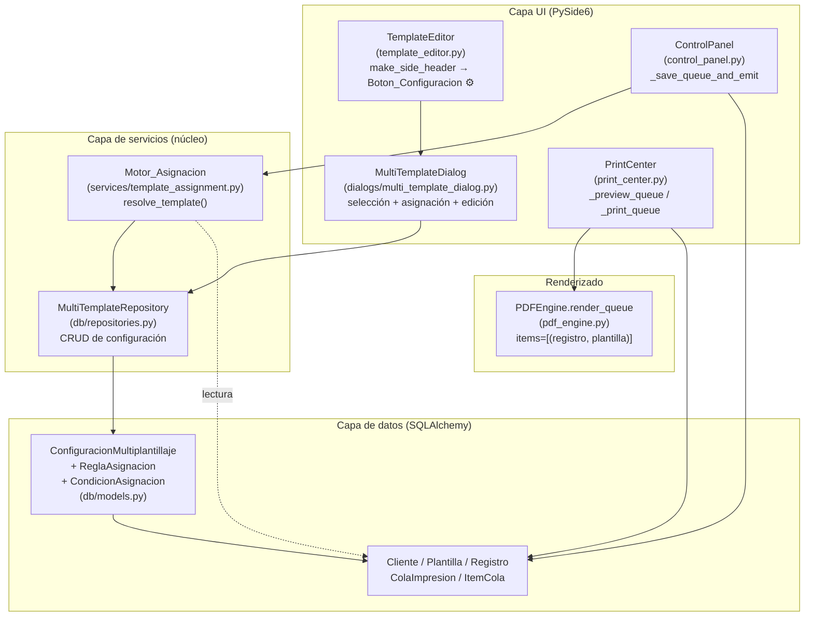
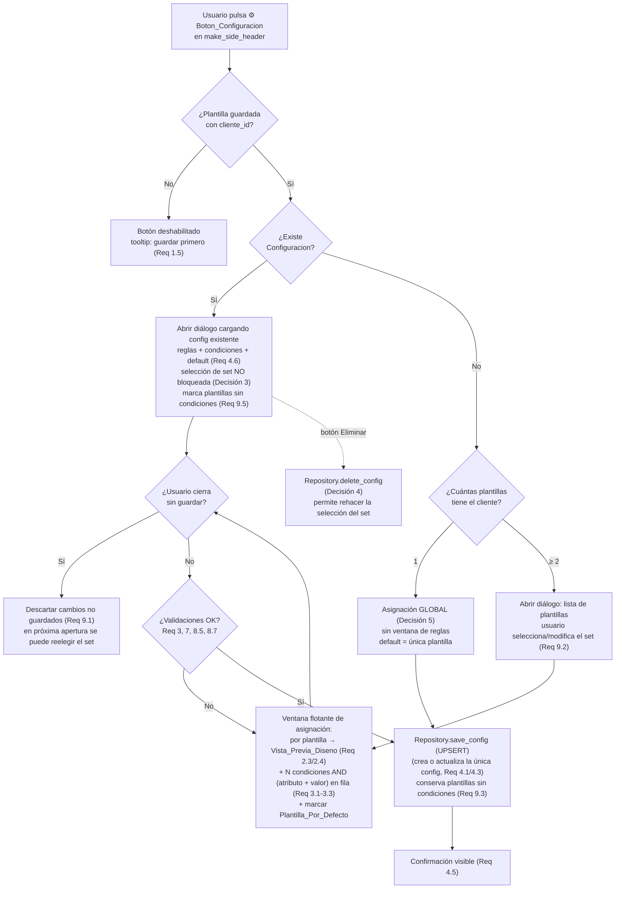
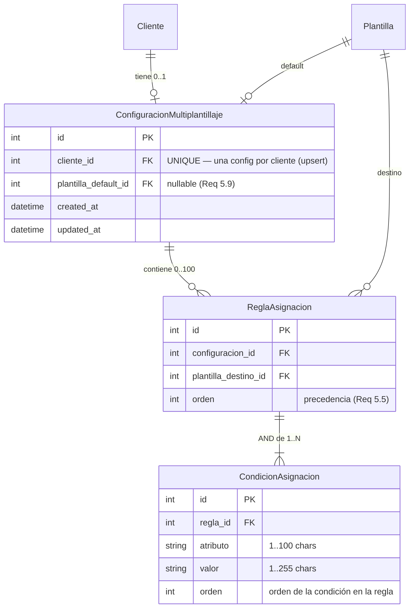

# Documento de Diseño — Multiplantillaje Base

## Overview

El **multiplantillaje base** introduce la capacidad de asociar varias plantillas (diseños) a un mismo Cliente y resolver automáticamente, registro por registro, qué plantilla se usa al imprimir, en función del valor de un atributo del registro.

Hoy el flujo de impresión es mono-plantilla: el usuario elige una plantilla en `control_panel.py`, y al guardar la cola se crea un `ItemCola` por registro, todos con el mismo `plantilla_id` (`_save_queue_and_emit`). El renderizado (`print_center.py` + `pdf_engine.render_queue`) ya está preparado para mezclar plantillas porque opera sobre pares `(registro, plantilla)` derivados de `ItemCola.plantilla_id`. Es decir, **la infraestructura de renderizado por ítem ya existe**; lo que falta es: (1) un lugar donde persistir las reglas de asignación, (2) un motor que las evalúe, y (3) los puntos de UI/flujo que generen el `plantilla_id` correcto por ítem.

Cada **Regla_Asignacion** combina una o más **Condicion_Asignacion** del tipo "atributo igual a valor" en **conjunción lógica (Y)**: la regla coincide solo cuando **todas** sus condiciones se cumplen (por ejemplo `grado == 1 Y grupo == "A"`). Una regla con una sola condición equivale a la antigua regla simple, lo que preserva la semántica previa como caso particular.

El diseño se apoya en estas decisiones de arquitectura tomadas por el usuario:

1. **Modelo dedicado** para la configuración de multiplantillaje (no se reutiliza `Cliente.config`), de modo que el esquema pueda evolucionar sin tocar la integridad de `Cliente`.
2. **Flujo de asignación mediante ventana flotante (diálogo modal)**: al seleccionar varias plantillas se abre un diálogo que lista las plantillas elegidas, muestra la Vista_Previa_Diseno de cada una y permite definir, en la fila de cada plantilla, una o más condiciones (atributo + valor) en conjunción.
3. **Continuación y reentrada (sin bloqueo de la selección base)**: la selección base del set de plantillas **no** se bloquea hasta que se guarda. Al cerrar el diálogo sin guardar se descartan los cambios no guardados y el usuario puede reelegir plantillas en la siguiente apertura. Una configuración guardada puede estar **parcialmente completa** (con plantillas seleccionadas aún sin condiciones), que se conservan para completarlas más tarde desde el Boton_Configuracion. *(Revisa y reemplaza la antigua "Decisión 3 – Bloqueo de reasignación".)*
4. **Configuración única por cliente (upsert)**: `save_config` realiza un upsert sobre la única `ConfiguracionMultiplantillaje` del cliente (existe `UNIQUE(cliente_id)`): la crea si no existe, la actualiza si existe, sin generar duplicados, reemplazando por completo sus reglas/condiciones. El Boton_Configuracion también permite eliminar la configuración para rehacer la selección del set.
5. **Asignación global para diseño único**: si el Cliente tiene una sola plantilla, no se abre la ventana de asignación; esa plantilla aplica a todos los registros sin reglas.

### Objetivos de diseño

- Mantener intacto el comportamiento actual cuando **no** existe configuración (Requisito 5.8).
- Aislar la lógica de evaluación (Motor_Asignacion) en una función pura y testeable.
- Persistir reglas y plantilla por defecto con flexibilidad y sin comprometer la integridad referencial.
- Integrar la creación de tablas al mecanismo de migraciones existente (`init_database` / `create_all`) sin romper datos.

### Alcance

| Dentro de alcance | Fuera de alcance |
| --- | --- |
| Nuevo modelo SQLAlchemy de configuración + reglas + condiciones | Operadores distintos a la igualdad (rangos, regex) |
| Reglas con condiciones compuestas en conjunción (AND) | Disyunción (OR) dentro de una misma regla |
| Diálogo modal de asignación y de edición con Vista_Previa_Diseno | Sincronización de configuración entre clientes |
| Motor_Asignacion (función pura, semántica AND) | Cambios al motor de PDF más allá de aprovechar `render_queue` |
| Integración en armado de cola y render | |

---

## Architecture

### Vista de componentes



### Decisiones arquitectónicas y justificación

**1. Modelo dedicado en lugar de `Cliente.config` (Decisión 1).**
`Cliente.config` es un JSON multipropósito que ya almacena `known_attributes`, `last_sync`, plantillas de URL, etc. Mezclar ahí la configuración de multiplantillaje acoplaría dos dominios y haría frágil cualquier evolución. Un modelo dedicado da: integridad referencial real (FKs a `clientes` y `plantillas`), capacidad de borrado en cascada coherente, y libertad para ampliar el esquema más adelante.

**2. Reglas con condiciones compuestas (AND) en tablas relacionadas + orden explícito (ver Data Models).**
Las reglas necesitan **orden de precedencia** (Requisito 5.5: gana la primera coincidente) y soportar **una o más condiciones en conjunción** (Requisito 3.1). Una tabla `reglas_asignacion` con columna `orden` modela la precedencia, y una tabla hija `condiciones_asignacion` (1:N desde la regla) modela las condiciones `(atributo, valor)` de cada regla. La validación de unicidad de reglas se hace sobre el **conjunto** de condiciones de cada regla (Requisito 3.9). El modelo relacional mantiene integridad de FKs, escala hasta 100 reglas (Requisito 4.4) y se justifica frente a JSON en la sección Data Models.

**3. Motor_Asignacion como función pura en una capa de servicios nueva (`services/`).**
La evaluación de reglas no depende de Qt ni de I/O. Aislarla como función pura (recibe datos planos, devuelve un id de plantilla o un resultado de error) la hace 100% testeable con property-based testing y reutilizable tanto desde `control_panel.py` como desde cualquier punto futuro del flujo. La semántica es **AND**: una regla coincide solo si **todas** sus condiciones se cumplen.

**4. Aprovechar el renderizado por ítem existente.**
No se modifica `pdf_engine.render_queue` ni la firma de `ItemCola`. El multiplantillaje solo cambia **qué `plantilla_id` se escribe** en cada `ItemCola` durante `_save_queue_and_emit`. Esto minimiza el blast radius y preserva el Requisito 5.8 (sin config → comportamiento actual).

### Flujo de configuración (selección → asignación → persistencia)



### Flujo de impresión (asignación automática)


---

## Components and Interfaces

### 1. Capa de datos — `db/models.py`

Se definen tres modelos (detallados en Data Models): `ConfiguracionMultiplantillaje`, `ReglaAsignacion` y el nuevo `CondicionAsignacion` (tabla hija 1:N de la regla, que aloja cada par `atributo`/`valor` de la conjunción). Se registran en `migrations.py` para que `create_all` los incluya.

### 2. Repositorio — `db/repositories.py`

Encapsula el CRUD de la configuración para que la UI y el flujo no manipulen sesiones directamente. `save_config` realiza un **upsert** sobre la única configuración del cliente (reemplazo total de reglas y condiciones) y `get_config` entrega la lectura completa como DTOs (regla con su lista de condiciones).

### 3. Motor de asignación — `services/template_assignment.py`

Función pura `resolve_template(...)` que evalúa las reglas en orden y devuelve un resultado tipado. Una regla coincide **solo si todas sus condiciones se cumplen** (AND). No abre sesiones; recibe estructuras de datos ya cargadas (un DTO de configuración) para ser determinista y testeable.

### 4. UI — Diálogo `ui/dialogs/multi_template_dialog.py`

`MultiTemplateDialog(QDialog)` modal, con la ventana flotante `TemplateAssignmentWindow` para la asignación por plantilla. Responsabilidades según estado:
- **Creación**: lista plantillas del cliente, permite seleccionar/modificar el set (sin bloqueo), abre la sub-vista de asignación por plantilla.
- **Edición / reentrada**: carga la configuración existente (reglas con sus condiciones y default), **mantiene editable la selección del set** (Decisión 3 revisada), permite editar/eliminar reglas y condiciones, cambiar el default, e indica visualmente las plantillas sin condiciones (Req 9.5).
- **Eliminación**: botón que borra la configuración completa.

Cada fila de plantilla muestra la **Vista_Previa_Diseno** (imagen base de `Plantilla.recursos` `fondo_frente`/`fondo_vuelta`, con indicador si no hay imagen, Req 2.3/2.4) y permite **agregar/quitar condiciones** (atributo + valor en la misma fila), manteniendo al menos una condición por regla (Req 3.3).

Para diseño único (Decisión 5), el diálogo puede no mostrarse: la lógica de apertura en `template_editor.py` decide entre "asignación global silenciosa" y "abrir diálogo".

### 5. UI — Integración en `template_editor.py` (`make_side_header`)

Se añade un `QPushButton` con `qta.icon("fa5s.cog")` junto al `btn_prev` (vista previa) de cada lado. Habilitado solo si `self._plantilla` está guardada (tiene `cliente_id`).

### 6. Flujo — `control_panel.py` (`_save_queue_and_emit`)

Antes de crear los `ItemCola`, consulta la configuración del cliente y, si existe, resuelve `plantilla_id` por registro con el Motor_Asignacion. Si no existe, conserva el camino actual.

### Tabla de interfaces públicas

| Componente | Símbolo | Responsabilidad |
| --- | --- | --- |
| `services/template_assignment.py` | `resolve_template(datos, config, plantilla_cola_id) -> AssignmentResult` | Evaluar reglas (AND de condiciones) y resolver plantilla por registro |
| `services/template_assignment.py` | `normalize(value) -> str` | Normalización de texto (lower + strip) para comparación por condición |
| `db/repositories.py` | `MultiTemplateRepository.get_config(session, cliente_id) -> ConfigDTO \| None` | Cargar configuración completa (reglas con condiciones) |
| `db/repositories.py` | `MultiTemplateRepository.save_config(session, cliente_id, reglas, plantilla_default_id) -> ConfiguracionMultiplantillaje` | Upsert: crear o actualizar la única config del cliente |
| `db/repositories.py` | `MultiTemplateRepository.delete_config(session, cliente_id) -> bool` | Eliminar configuración (Decisión 4) |
| `db/repositories.py` | `MultiTemplateRepository.list_templates(session, cliente_id) -> list[Plantilla]` | Listar plantillas del cliente para el diálogo |
| `ui/dialogs/multi_template_dialog.py` | `MultiTemplateDialog(cliente_id, parent)` | Diálogo modal de configuración |

---

## Data Models

### Elección de almacenamiento: tablas relacionales para reglas y condiciones (justificación)

Se evaluaron dos opciones para guardar las reglas y sus condiciones:

| Criterio | Tablas `reglas_asignacion` + `condiciones_asignacion` (elegida) | JSON dentro del modelo |
| --- | --- | --- |
| Integridad FK a la plantilla destino | Nativa (`ForeignKey` + `ondelete`) | No, hay que validar a mano |
| Orden de precedencia de reglas (Req 5.5) | Columna `orden` explícita, indexable | Posición en array (frágil al editar) |
| Condiciones múltiples por regla (AND, Req 3.1) | Tabla hija 1:N con `orden` por condición | Array anidado en JSON |
| Unicidad del conjunto de condiciones (Req 3.9) | Comparación de conjuntos por filas | Recorrer y comparar en código |
| Detección de plantilla inexistente (Req 8.6) | Se detecta vía relación rota / consulta | Se detecta solo en runtime |
| Extensibilidad futura (más campos por condición) | Añadir columnas | Reescribir JSON |
| Flexibilidad de esquema general | Alta | Alta |

Se prioriza **integridad + extensibilidad**, por lo que las reglas viven en su propia tabla y cada condición de la conjunción en una tabla hija `condiciones_asignacion` ligada a la regla. La referencia a la **Plantilla_Por_Defecto** se guarda como FK directa (`plantilla_default_id`) en la tabla de configuración, obligatoria a nivel de dominio (Req 4.4) pero modelada como nullable para soportar el caso de error 5.9 (sin default configurado) sin romper la inserción.

### Esquema relacional



> Nota: `atributo` y `valor` **dejan de vivir** en `ReglaAsignacion` y pasan a `CondicionAsignacion`. `ReglaAsignacion` conserva `(configuracion_id, plantilla_destino_id, orden)`. Una regla con una sola condición reproduce la semántica simple anterior.

### `ConfiguracionMultiplantillaje`

```python
class ConfiguracionMultiplantillaje(Base):
    """Configuración de multiplantillaje por Cliente (Decisión 1).

    Agrupa las reglas de asignación y referencia la plantilla por defecto.
    Relación 1:1 con Cliente: una configuración por cliente como máximo
    (Req 4.1/4.2 — `save_config` hace upsert sobre esta única fila).
    """
    __tablename__ = "configuraciones_multiplantillaje"

    id: Mapped[int] = mapped_column(Integer, primary_key=True, autoincrement=True)
    cliente_id: Mapped[int] = mapped_column(
        Integer, ForeignKey("clientes.id", ondelete="CASCADE"),
        nullable=False, unique=True,  # 1 config por cliente
    )
    # Nullable para soportar Req 5.8 (sin default). El dominio exige default,
    # pero la columna lo admite para no bloquear estados de error controlados.
    plantilla_default_id: Mapped[int | None] = mapped_column(
        Integer, ForeignKey("plantillas.id", ondelete="SET NULL"), nullable=True,
    )

    created_at: Mapped[datetime] = mapped_column(
        DateTime, nullable=False, server_default=func.now()
    )
    updated_at: Mapped[datetime] = mapped_column(
        DateTime, nullable=False, server_default=func.now(), onupdate=func.now()
    )

    cliente: Mapped["Cliente"] = relationship()
    plantilla_default: Mapped["Plantilla | None"] = relationship(
        foreign_keys=[plantilla_default_id]
    )
    reglas: Mapped[list["ReglaAsignacion"]] = relationship(
        back_populates="configuracion",
        cascade="all, delete-orphan",
        order_by="ReglaAsignacion.orden",
    )
```

### `ReglaAsignacion`

```python
class ReglaAsignacion(Base):
    """Regla con destino, compuesta por una o más Condicion_Asignacion en AND (Req 3.1).

    `atributo`/`valor` ya NO viven aquí: se trasladaron a `CondicionAsignacion`.
    El campo `orden` define la precedencia de evaluación de la regla (Req 5.5).
    """
    __tablename__ = "reglas_asignacion"

    id: Mapped[int] = mapped_column(Integer, primary_key=True, autoincrement=True)
    configuracion_id: Mapped[int] = mapped_column(
        Integer,
        ForeignKey("configuraciones_multiplantillaje.id", ondelete="CASCADE"),
        nullable=False,
    )
    plantilla_destino_id: Mapped[int] = mapped_column(
        Integer, ForeignKey("plantillas.id", ondelete="CASCADE"), nullable=False,
    )
    orden: Mapped[int] = mapped_column(Integer, nullable=False, default=0)

    configuracion: Mapped["ConfiguracionMultiplantillaje"] = relationship(
        back_populates="reglas"
    )
    plantilla_destino: Mapped["Plantilla"] = relationship(
        foreign_keys=[plantilla_destino_id]
    )
    # Condiciones en conjunción (AND). Ordenadas por `orden`; borrado en cascada
    # para que al eliminar una regla desaparezcan sus condiciones (Req 3.3).
    condiciones: Mapped[list["CondicionAsignacion"]] = relationship(
        back_populates="regla",
        cascade="all, delete-orphan",
        order_by="CondicionAsignacion.orden",
    )
```

### `CondicionAsignacion`

```python
class CondicionAsignacion(Base):
    """Condición 'atributo igual a valor' de una Regla_Asignacion (Req 3.1).

    Una Regla_Asignacion coincide únicamente cuando TODAS sus condiciones se
    cumplen (conjunción lógica Y). `orden` ordena las condiciones dentro de la
    regla para una presentación/serialización estable.
    """
    __tablename__ = "condiciones_asignacion"

    id: Mapped[int] = mapped_column(Integer, primary_key=True, autoincrement=True)
    regla_id: Mapped[int] = mapped_column(
        Integer, ForeignKey("reglas_asignacion.id", ondelete="CASCADE"),
        nullable=False,
    )
    atributo: Mapped[str] = mapped_column(String(100), nullable=False)
    valor: Mapped[str] = mapped_column(String(255), nullable=False)
    orden: Mapped[int] = mapped_column(Integer, nullable=False, default=0)

    regla: Mapped["ReglaAsignacion"] = relationship(back_populates="condiciones")
```

> Nota sobre `ondelete` de `plantilla_destino_id`: se usa `CASCADE` para que al borrar una plantilla desaparezca su regla huérfana (y, en cascada, sus condiciones); el Requisito 8.6 (plantilla referenciada ya no existe al imprimir) se cubre adicionalmente en el Motor_Asignacion validando que el id resuelto exista, porque entre carga y render puede haber inconsistencias. Como alternativa de implementación se puede usar `SET NULL` + validación; el equipo de tareas decidirá, pero el motor debe ser defensivo en cualquier caso.

### DTOs de transporte (capa de servicios)

Para que el Motor_Asignacion sea puro y testeable sin sesión de BD, el repositorio entrega DTOs inmutables:

```python
from dataclasses import dataclass

@dataclass(frozen=True)
class CondicionDTO:
    atributo: str
    valor: str
    orden: int

@dataclass(frozen=True)
class ReglaDTO:
    plantilla_destino_id: int
    orden: int
    condiciones: tuple[CondicionDTO, ...]  # AND; 1..N condiciones (puede ser () en
                                           # config parcial: plantilla sin condiciones)

@dataclass(frozen=True)
class ConfigDTO:
    cliente_id: int
    plantilla_default_id: int | None
    reglas: tuple[ReglaDTO, ...]          # ya ordenadas por `orden`
    plantillas_existentes: frozenset[int] # ids de plantillas vigentes del cliente

@dataclass(frozen=True)
class AssignmentResult:
    plantilla_id: int | None
    status: str            # "matched" | "default" | "fallback_cola" | "error" | "warning_missing"
    rule_index: int | None # índice de la regla coincidente, si aplica
    message: str | None    # texto de error/advertencia para logging (identifica registro)
```

> **Configuración parcialmente completa (Req 9.3/9.4):** una `ReglaDTO` con `condiciones == ()` representa una plantilla seleccionada que aún no tiene condiciones. Se persiste para poder completarla luego, pero el Motor_Asignacion la trata como **no coincidente** (una regla sin condiciones no puede satisfacer "todas sus condiciones" frente a un registro arbitrario, por lo que nunca gana sobre una regla con condiciones reales). El diálogo la marca visualmente como pendiente (Req 9.5).

### Firma del Motor_Asignacion (Low-Level Design)

```python
def normalize(value: object) -> str:
    """Normaliza para comparación: str -> strip -> lower (Req 5.2, 8.8)."""
    return str(value if value is not None else "").strip().lower()


def resolve_template(
    datos: dict[str, object],
    config: ConfigDTO,
    plantilla_cola_id: int | None,
) -> AssignmentResult:
    """Resuelve la plantilla para un registro.

    Orden de evaluación (Req 5.1, 5.5):
      1. Recorre `config.reglas` en orden ascendente de `orden`.
      2. Una regla COINCIDE solo si TODAS sus condiciones se cumplen (AND, Req 5.2):
         para cada `CondicionDTO`, si el registro NO contiene el atributo, la
         condición no se cumple (Req 8.1) y, por tanto, la regla no coincide
         (Req 5.3); en otro caso se compara
         normalize(datos[atributo]) == normalize(condicion.valor) (Req 5.2/8.8).
         Una regla SIN condiciones (config parcial) nunca coincide (Req 9.3).
      3. Primera regla coincidente gana -> status="matched" (Req 5.5).
      4. Si la plantilla destino de la regla coincidente no está en
         config.plantillas_existentes -> tratar como no coincidente y registrar
         advertencia (Req 8.6); seguir buscando / caer a default.
      5. Sin coincidencias:
           - default definido y existente -> status="default" (Req 5.4/8.2).
           - sin default y hay plantilla_cola_id -> status="fallback_cola"
             (Req 8.3, advertencia).
           - sin default y sin plantilla_cola_id -> status="error",
             plantilla_id=None (Req 5.9/8.4). Los datos del registro no se tocan.
    """
```

### Métodos de repositorio (Low-Level Design)

```python
class MultiTemplateRepository:
    @staticmethod
    def get_config(session, cliente_id: int) -> ConfigDTO | None:
        """Carga la única configuración del cliente como ConfigDTO, con cada
        ReglaDTO trayendo su tupla de CondicionDTO ordenada por `orden`."""

    @staticmethod
    def save_config(
        session, cliente_id: int,
        reglas: list[ReglaDTO],
        plantilla_default_id: int | None,
    ) -> ConfiguracionMultiplantillaje:
        """UPSERT sobre la única ConfiguracionMultiplantillaje del cliente (Req 4.1/4.3).

        - Si el cliente NO tiene configuración: crea una nueva.
        - Si ya tiene: actualiza la existente reemplazando por completo sus
          reglas y condiciones (no crea una fila adicional; respeta UNIQUE
          cliente_id).
        Idempotente respecto al contenido: guardar dos veces el mismo conjunto de
        reglas/condiciones y el mismo default deja el mismo estado lógico, sin
        reglas ni condiciones residuales (Req 4.4, 6.5, 6.7). Acepta reglas con
        `condiciones == ()` para soportar configuración parcial (Req 9.3)."""

    @staticmethod
    def delete_config(session, cliente_id: int) -> bool: ...

    @staticmethod
    def list_templates(session, cliente_id: int) -> list["Plantilla"]: ...

    @staticmethod
    def available_attributes(session, cliente_id: int) -> list[str]:
        """Combina Cliente.config['known_attributes'] + claves de Registro.datos,
        sin duplicados, comparando insensible a mayúsculas/espacios (Req 7.1-7.3)."""
```

> **Implementación del upsert:** la implementación actual logra el upsert borrando la fila previa del cliente y recreándola dentro de la misma transacción (`delete_config` + `flush` + insert), lo que respeta el `UNIQUE(cliente_id)` y deja un único registro. Es válido evolucionar a un upsert "in-place" (reusar la fila existente y reemplazar la colección de reglas vía `cascade="all, delete-orphan"`) para conservar `id`/`created_at`; ambas variantes satisfacen "sin duplicados" (Req 4.1/4.3). El equipo de tareas elige; la propiedad de no-duplicación (Property 7) cubre ambas.

### Punto de integración en `control_panel.py`

```python
def _resolve_plantilla_id(registro, config_dto, plantilla_cola_id) -> int | None:
    """Wrapper de UI sobre resolve_template; traduce el AssignmentResult en
    plantilla_id o None y emite el status/log correspondiente."""
    result = resolve_template(registro.datos or {}, config_dto, plantilla_cola_id)
    if result.status in ("error",):
        logger.error(result.message)   # identifica el registro (Req 5.9/8.4)
        return None
    if result.status in ("fallback_cola", "warning_missing"):
        logger.warning(result.message)
    return result.plantilla_id
```

### Integración con migraciones

`migrations.py` importa y registra los modelos nuevos para que `Base.metadata.create_all(engine)` los cree. Como `create_all` **solo crea tablas que no existen**, no afecta datos ni tablas actuales:

```python
# db/migrations.py
from credencializacion.db.models import (
    Base, Cliente, Plantilla, ColaImpresion, ItemCola,
    ConfiguracionMultiplantillaje, ReglaAsignacion, CondicionAsignacion,  # nuevos
)

def init_database() -> None:
    engine = get_engine()
    Base.metadata.create_all(engine)  # crea solo las tablas faltantes
```

Para instalaciones existentes con la BD ya creada, `create_all` añadirá las tablas nuevas (`configuraciones_multiplantillaje`, `reglas_asignacion`, `condiciones_asignacion`) en el siguiente arranque sin tocar `clientes`, `plantillas`, `registros`, `colas_impresion` ni `items_cola`. No se requiere backfill: la ausencia de configuración equivale al comportamiento actual (Req 5.8).

**Migración de reglas existentes (si las hubiera).** El cambio de esquema mueve `atributo`/`valor` de `reglas_asignacion` a la nueva `condiciones_asignacion`. Como `create_all` no altera columnas de tablas ya existentes, la estrategia es:

1. **Instalaciones sin datos de multiplantillaje** (caso esperado hoy, pues la funcionalidad aún no está en producción): `create_all` crea las tres tablas con el esquema nuevo y no hay nada que migrar.
2. **Instalaciones que ya tuvieran `reglas_asignacion` con columnas `atributo`/`valor` pobladas**: ejecutar un paso de migración único e idempotente que, por cada regla existente con su par `(atributo, valor)`, cree **una** `CondicionAsignacion` (`regla_id`, `atributo`, `valor`, `orden=0`) y luego elimine las columnas `atributo`/`valor` de `reglas_asignacion`. Es decir, **cada regla simple se convierte en una regla con una sola condición**, preservando exactamente la semántica anterior. El paso se guarda contra una marca de versión de esquema para no re-ejecutarse, y se realiza dentro de una transacción para no romper datos si falla.

Dado que la funcionalidad es nueva, el escenario (1) es el real; el (2) se documenta como red de seguridad para entornos de prueba que hubieran creado reglas con el esquema anterior.

---

## Correctness Properties

*Una propiedad es una característica o comportamiento que debe cumplirse en todas las ejecuciones válidas del sistema — esencialmente, una afirmación formal sobre lo que el sistema debe hacer. Las propiedades son el puente entre la especificación legible por humanos y las garantías de correctitud verificables por máquina.*

El núcleo property-based de esta funcionalidad es el **Motor_Asignacion** (función pura sobre un espacio de entrada amplio: datos de registro × reglas con condiciones en conjunción) y la **capa de persistencia** (round-trip y upsert). Los detalles de UI (apertura de diálogo, tooltips, confirmaciones visibles, Vista_Previa_Diseno, indicador de plantillas sin condiciones, reelección del set tras cerrar sin guardar) se cubren con tests de ejemplo/widget, no con PBT.

### Property 1: Coincidencia por conjunción (AND) y precedencia determinista

*Para toda* combinación de datos de registro y configuración con reglas, `resolve_template` evalúa las reglas en orden ascendente de `orden` y considera que una regla **coincide solo si TODAS sus condiciones se cumplen** (cada condición se cumple cuando su atributo está presente en el registro y `normalize(datos[atributo]) == normalize(condicion.valor)`); una regla sin condiciones nunca coincide. Devuelve la Plantilla_Destino de la **primera** regla coincidente con destino vigente. Llamarla dos veces con la misma entrada produce el mismo resultado.

**Validates: Requirements 5.1, 5.2, 5.3, 5.5, 8.1, 9.3**

### Property 2: Idempotencia e invariancia de la normalización de comparación

*Para todo* valor de texto, `normalize(normalize(x)) == normalize(x)`, y *para todo* par de valores que difieran únicamente en mayúsculas/minúsculas y/o espacios iniciales o finales, la comparación del Motor_Asignacion los considera coincidentes.

**Validates: Requirements 5.2, 8.8**

### Property 3: Fallback a la Plantilla_Por_Defecto

*Para todo* registro cuyos datos no hacen coincidir ninguna regla (incluidas las reglas sin condiciones), cuando existe una Plantilla_Por_Defecto definida y vigente, `resolve_template` devuelve esa plantilla por defecto.

**Validates: Requirements 5.4, 8.2**

### Property 4: Fallback a la plantilla de la cola sin default

*Para todo* registro sin coincidencias cuando no hay Plantilla_Por_Defecto definida pero sí existe una plantilla seleccionada en la cola, `resolve_template` devuelve la plantilla de la cola y produce una advertencia que identifica al registro.

**Validates: Requirements 8.3**

### Property 5: Error sin default ni plantilla de cola, datos intactos

*Para todo* registro sin coincidencias cuando no hay Plantilla_Por_Defecto ni plantilla de cola, `resolve_template` devuelve `plantilla_id = None` con estado de error y un mensaje que identifica al registro, y los datos del registro permanecen sin modificación.

**Validates: Requirements 5.9, 8.4**

### Property 6: Plantilla destino inexistente cae a default

*Para toda* regla cuya Plantilla_Destino ya no existe entre las plantillas vigentes del cliente, el Motor_Asignacion trata esa regla como no aplicable y resuelve a la Plantilla_Por_Defecto, produciendo una advertencia que identifica la regla afectada.

**Validates: Requirements 8.6**

### Property 7: Upsert único y round-trip jerárquico de la persistencia

*Para toda* configuración válida (0 a 100 reglas, cada regla con 0..N condiciones y una Plantilla_Por_Defecto), `save_config` deja **exactamente una** `ConfiguracionMultiplantillaje` para el cliente, y `get_config` devuelve exactamente las mismas reglas con sus condiciones (atributo, valor y orden de cada condición), el orden de precedencia de las reglas y la misma Plantilla_Por_Defecto. *Para todo* cliente que ya tenía configuración, volver a guardar otra configuración la **actualiza in situ sin crear una segunda fila** y reemplaza por completo reglas y condiciones, sin dejar residuales.

**Validates: Requirements 4.1, 4.2, 4.3, 4.4, 4.6, 6.5, 6.7**

### Property 8: Edición y eliminación parcial preservan el resto

*Para toda* configuración persistida, editar un campo de una condición (atributo o valor), cambiar la Plantilla_Destino de una regla, o eliminar una regla o una condición, deja inalterados todos los demás campos de esa regla y todas las demás reglas y condiciones de la configuración.

**Validates: Requirements 6.1, 6.2, 6.3**

### Property 9: Configuración parcial: plantillas sin condiciones se conservan y no coinciden

*Para toda* configuración guardada con una o más reglas sin condiciones (plantillas seleccionadas aún sin condiciones), `get_config` las conserva como reglas con `condiciones == ()`, `resolve_template` nunca las hace coincidir para ningún registro, y agregar condiciones a una de esas reglas y volver a guardar actualiza solo esa regla, conservando el resto de la configuración.

**Validates: Requirements 9.3, 9.4, 9.6**

### Property 10: Rechazo de reglas con condiciones de campos obligatorios vacíos

*Para toda* regla en la que alguna de sus condiciones tenga atributo o valor vacío (cadena vacía o solo espacios), el guardado se rechaza y la configuración previamente mostrada/persistida se conserva sin alteración.

**Validates: Requirements 3.6, 6.4**

### Property 11: Validación de longitud de atributo y valor por condición

*Para todo* atributo de condición, se acepta si y solo si su longitud tras recortar espacios está en 1..100; *para todo* valor de condición, se acepta si y solo si su longitud está en 1..255. Las entradas fuera de rango se rechazan conservando el valor previo.

**Validates: Requirements 3.1, 3.4, 7.5**

### Property 12: Rechazo de reglas con conjunto de condiciones duplicado

*Para toda* configuración, intentar agregar una regla cuyo **conjunto** de condiciones `(atributo, valor)` —comparado de forma normalizada e independiente del orden— coincide con el conjunto de condiciones de una regla existente, se rechaza y la configuración no cambia.

**Validates: Requirements 3.9**

### Property 13: Exactamente una Plantilla_Por_Defecto

*Para toda* configuración válida persistida, existe exactamente una referencia de Plantilla_Por_Defecto y esa plantilla pertenece al conjunto de plantillas del cliente.

**Validates: Requirements 3.8**

### Property 14: Construcción de Atributos_Disponibles

*Para toda* combinación de `Cliente.config["known_attributes"]` y claves presentes en `Registro.datos`, la lista de Atributos_Disponibles no contiene duplicados bajo comparación normalizada (insensible a mayúsculas y espacios circundantes), incluye solo claves cuya longitud tras recortar espacios está en 1..100, y omite las vacías.

**Validates: Requirements 7.1, 7.2, 7.3**

### Property 15: list_templates filtra por cliente

*Para todo* conjunto de clientes con plantillas, `list_templates(cliente_id)` devuelve exactamente las plantillas de ese cliente y ninguna de otro.

**Validates: Requirements 2.1**

### Property 16: Solo plantillas del mismo cliente como destino

*Para toda* plantilla candidata a Plantilla_Destino, la selección se acepta si y solo si la plantilla pertenece al cliente en edición; las plantillas de otros clientes se rechazan conservando la selección previa.

**Validates: Requirements 8.5**

### Property 17: Detección de diferencia de orientación o dimensiones

*Para todo* conjunto de plantillas mapeadas en la configuración, se dispara la advertencia previa al guardado si y solo si existe al menos un par de plantillas que difiere en orientación o en alguna dimensión de lienzo (ancho o alto).

**Validates: Requirements 8.7**

### Property 18: El armado de cola asigna la plantilla resuelta por ítem

*Para todo* conjunto de registros: cuando existe configuración, cada `ItemCola` creado recibe el `plantilla_id` que `resolve_template` resuelve para su registro; cuando no existe configuración, todos los `ItemCola` reciben la plantilla seleccionada en la cola (comportamiento actual preservado).

**Validates: Requirements 5.6, 5.8**

---

## Error Handling

### Estrategia general

El manejo de errores distingue tres capas con responsabilidades distintas:

| Capa | Tipo de error | Estrategia |
| --- | --- | --- |
| Motor_Asignacion (puro) | Lógicos (sin coincidencia, sin default, destino inexistente) | Nunca lanza excepción por estos casos: devuelve `AssignmentResult` tipado con `status` + `message`. El llamador decide logging/UI. |
| Repositorio / BD | Transaccionales (fallo de commit, fallo de carga) | `DatabaseSession` hace rollback automático en excepción. El repositorio propaga la excepción; la UI la captura y muestra mensaje, conservando el estado en pantalla. |
| UI (diálogo) | Validación e interacción | Validación previa al guardado; mensajes por campo; no se cierra el diálogo en error. |

### Casos borde y su tratamiento

| Caso (Requisito) | Tratamiento |
| --- | --- |
| Registro sin el atributo de una condición de la regla (8.1) | Esa condición no se cumple → la regla (AND) no coincide; se continúa con las siguientes. Sin excepción. |
| Regla sin condiciones / plantilla sin condiciones (9.3) | La regla nunca coincide; la plantilla se conserva en la config para completarla luego. |
| Sin coincidencia, con default (5.4, 8.2) | Se asigna la Plantilla_Por_Defecto. |
| Sin coincidencia, sin default, con plantilla de cola (8.3) | Se asigna la plantilla de la cola; `logger.warning` identificando el registro. |
| Sin coincidencia, sin default, sin plantilla de cola (5.9, 8.4) | `plantilla_id=None`; `logger.error` identificando el registro; el registro se omite en el render; los datos no se tocan. |
| Plantilla de la regla ya no existe (8.6) | Se trata como no coincidente → default; `logger.warning` identificando la regla. |
| Plantilla asignada no cargable al render (5.10) | `print_center` omite ese ítem y continúa con el resto; mensaje de error identificando registro y plantilla. |
| Plantilla de otro cliente como destino (8.5) | El diálogo rechaza la selección y conserva la previa; mensaje al usuario. |
| Plantillas con orientación/dimensiones distintas (8.7) | Advertencia previa al guardado con opción confirmar/cancelar. |
| Atributos disponibles vacíos (3.5, 7.4) | El diálogo impide crear condición por selector y permite entrada manual de atributo. |
| Cerrar el diálogo sin guardar (9.1, 9.2) | Se descartan los cambios no guardados; la selección base no queda bloqueada y es reelegible en la siguiente apertura. |
| Fallo al persistir (4.8, 6.6) | Rollback; estado en pantalla intacto; mensaje con la causa. |
| Fallo al cargar configuración (4.9) | Diálogo se abre sin reglas precargadas; mensaje con la causa. |
| Diálogo no puede abrirse (1.6) | Editor permanece sin cambios; mensaje de error. |

### Logging para identificación de registros

Los mensajes de error/advertencia del Motor_Asignacion deben identificar de forma única al registro afectado (id y, si está disponible, `enrollment_code` o `nombre_completo`) para cumplir 5.9, 8.3 y 8.4, sin volcar todo el contenido de `datos` (evitar ruido y posible PII en logs).

---

## Testing Strategy

### Enfoque dual

- **Tests de ejemplo / unitarios**: cubren interacciones de UI (apertura de diálogo, tooltips, botón deshabilitado, confirmaciones visibles), manejo de errores con mocks (rollback, fallo de carga), y casos borde concretos.
- **Tests basados en propiedades (PBT)**: cubren la lógica universal del Motor_Asignacion, la normalización, la construcción de atributos disponibles, las validaciones de reglas y el round-trip de persistencia.

### Aplicabilidad de PBT

PBT **sí aplica** porque el corazón de la funcionalidad (Motor_Asignacion con semántica AND, normalización, validaciones por condición, combinación de atributos, round-trip/upsert de persistencia) son funciones puras con propiedades universales sobre un espacio de entrada amplio. PBT **no aplica** a:
- El renderizado PDF por ítem (ReportLab, I/O) → tests de integración (1-3 ejemplos) verificando que `render_queue` usa la plantilla de cada ítem y que omite ítems con recursos faltantes.
- La construcción de widgets PySide6 (ubicación del botón, tooltips, Vista_Previa_Diseno e indicador de imagen no disponible, indicador de plantillas sin condiciones, atributo+valor en la misma fila, agregar/quitar condiciones, reelección del set tras cerrar sin guardar) → tests de ejemplo/widget.
- El fallo transaccional de la BD → tests de ejemplo con mock que fuerza la excepción.

### Librería de PBT

- Lenguaje objetivo: **Python**. Librería recomendada: **Hypothesis** (estándar de facto para PBT en Python; integra con pytest, ya presente como dependencia de desarrollo).
- Añadir `hypothesis` al grupo `dev` de `pyproject.toml`. **No** implementar PBT desde cero.
- Configurar cada test de propiedad para ejecutar **mínimo 100 iteraciones** (`@settings(max_examples=100)`).
- Etiquetar cada test con un comentario que referencie la propiedad de diseño:
  - Formato: `# Feature: multiplantillaje-base, Property {número}: {texto de la propiedad}`
- Implementar cada propiedad de correctitud con **un único** test basado en propiedades.

### Generadores (estrategias) clave

- **Datos de registro**: dicts con claves de atributo (de un alfabeto que incluye mayúsculas/minúsculas y espacios circundantes para ejercitar la normalización) y valores de texto.
- **Reglas con condiciones (AND)**: cada regla genera `(plantilla_destino_id, orden, condiciones)` donde `condiciones` es una tupla de 0..N pares `(atributo, valor, orden)`; se cubren reglas de 1, varias y **cero** condiciones (config parcial) y configuraciones de 0 y 100 reglas (límites del Req 4.4). Para ejercitar la coincidencia AND, generar registros que cumplen un subconjunto y el conjunto completo de las condiciones de una regla.
- **Conjuntos de condiciones duplicados**: generar reglas con el mismo conjunto de condiciones en distinto orden para Property 12.
- **Plantillas**: ids con orientación ∈ {horizontal, vertical} y dimensiones ancho/alto para ejercitar la detección de diferencias (Property 17) y la pertenencia por cliente (Property 15/16).
- **Casos de normalización**: para cada valor base, derivar variantes con cambios de caso y espacios para Property 2.
- **Upsert**: generar dos configuraciones distintas para el mismo cliente y verificar una única fila tras guardar dos veces (Property 7).

### Persistencia en tests

- Las propiedades de round-trip/upsert (Property 7, 8, 9, 12, 13) se ejecutan contra una BD SQLite **en memoria** (`sqlite:///:memory:`) o un archivo temporal por test, usando los modelos reales (incluida la nueva `CondicionAsignacion`) para validar integridad de FKs y cascadas (regla → condiciones), manteniendo el costo bajo para 100+ iteraciones.

### Cobertura por propiedad

| Propiedad | Tipo de test | Notas |
| --- | --- | --- |
| P1–P6 (Motor_Asignacion, AND) | PBT puro | Sin BD; sobre `ConfigDTO` con reglas multi-condición generadas. |
| P7, P8, P9, P12, P13 (persistencia) | PBT con SQLite en memoria | Round-trip jerárquico, upsert único, edición/parcial, duplicados, default. |
| P10, P11, P14 (validación/atributos) | PBT puro | Validadores por condición y combinador de atributos. |
| P15, P16 (alcance por cliente) | PBT con SQLite en memoria | Filtro por `cliente_id`. |
| P17 (diferencias de plantilla) | PBT puro | Sobre metadatos de plantilla. |
| P18 (armado de cola) | PBT con SQLite en memoria | Verifica `ItemCola.plantilla_id` por ítem, con y sin config. |
| 5.7, 5.10 (render) | Integración (1-3 ejemplos) | `render_queue` por ítem y omisión por recurso faltante. |
| 1.x, 2.2/2.3/2.4/2.5, 3.3, 4.5, 4.8, 4.9, 6.6, 9.1/9.2/9.5 | Ejemplo / widget / mock | UI (Vista_Previa_Diseno, condiciones por fila, indicador sin condiciones, reelección del set) y manejo de errores. |

### Consideraciones de migración y compatibilidad

- `init_database` (vía `create_all`) crea las tres tablas nuevas (`configuraciones_multiplantillaje`, `reglas_asignacion`, `condiciones_asignacion`) sin tocar las existentes; no se requiere backfill en instalaciones nuevas.
- Si una instalación de prueba ya tuviera `reglas_asignacion` con columnas `atributo`/`valor` pobladas, el paso de migración idempotente convierte cada regla en una regla con una única condición (ver "Migración de reglas existentes" en Data Models) antes de eliminar esas columnas.
- Compatibilidad hacia atrás garantizada por Property 18 (rama "sin configuración"): instalaciones existentes sin configuración mantienen el comportamiento mono-plantilla actual.
- Un test de integración debe verificar que, partiendo de una BD con el esquema previo (sin las tablas nuevas), tras `init_database` las tablas existen y los datos previos permanecen intactos.
