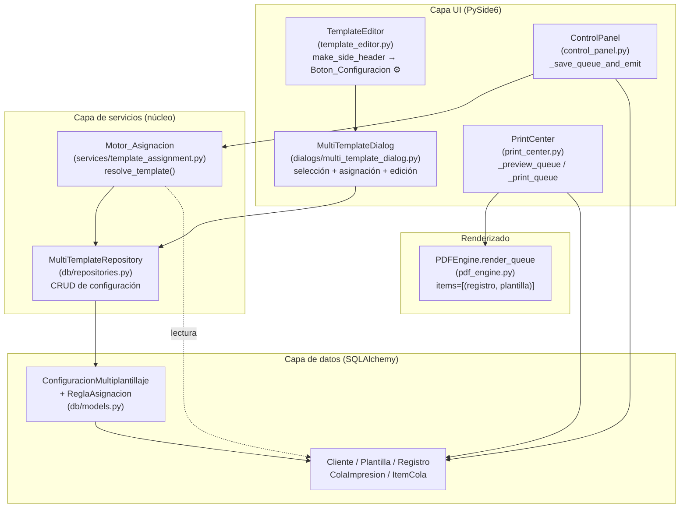
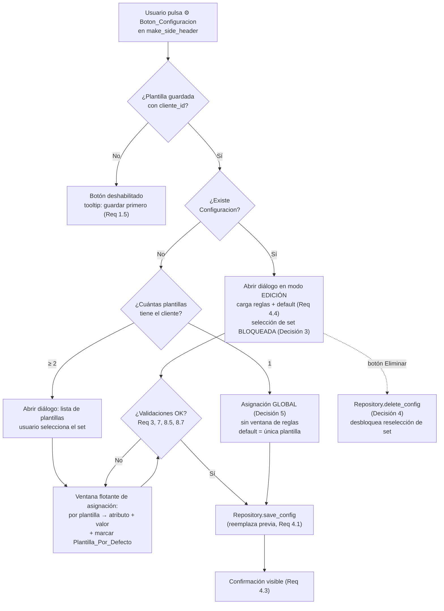
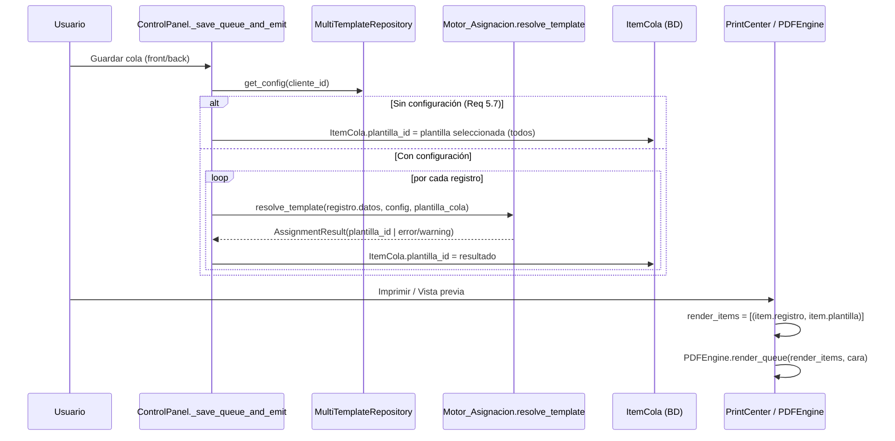
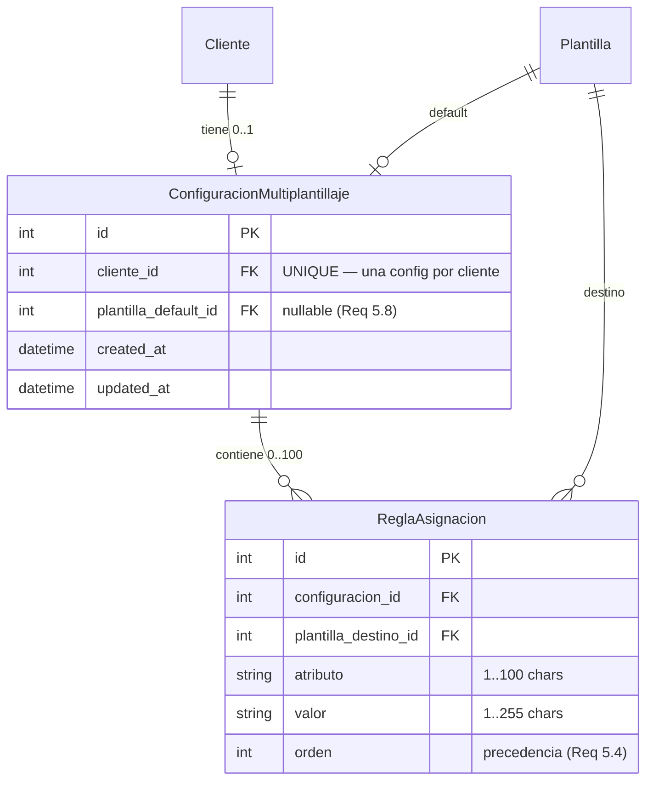

# Documento de Diseño — Multiplantillaje Base

## Overview

El **multiplantillaje base** introduce la capacidad de asociar varias plantillas (diseños) a un mismo Cliente y resolver automáticamente, registro por registro, qué plantilla se usa al imprimir, en función del valor de un atributo del registro.

Hoy el flujo de impresión es mono-plantilla: el usuario elige una plantilla en `control_panel.py`, y al guardar la cola se crea un `ItemCola` por registro, todos con el mismo `plantilla_id` (`_save_queue_and_emit`). El renderizado (`print_center.py` + `pdf_engine.render_queue`) ya está preparado para mezclar plantillas porque opera sobre pares `(registro, plantilla)` derivados de `ItemCola.plantilla_id`. Es decir, **la infraestructura de renderizado por ítem ya existe**; lo que falta es: (1) un lugar donde persistir las reglas de asignación, (2) un motor que las evalúe, y (3) los puntos de UI/flujo que generen el `plantilla_id` correcto por ítem.

El diseño se apoya en cinco decisiones de arquitectura tomadas por el usuario:

1. **Modelo dedicado** para la configuración de multiplantillaje (no se reutiliza `Cliente.config`), de modo que el esquema pueda evolucionar sin tocar la integridad de `Cliente`.
2. **Flujo de asignación mediante ventana flotante (diálogo modal)**: al seleccionar varias plantillas se abre un diálogo que lista las plantillas elegidas y permite asignar atributo y valor por cada una.
3. **Bloqueo de reasignación**: tras crear la configuración, el set de plantillas queda fijo; cualquier cambio posterior se hace desde el Boton_Configuracion (engranaje).
4. **Eliminar configuración**: el Boton_Configuracion permite borrar la configuración para poder rehacer la selección del set de plantillas.
5. **Asignación global para diseño único**: si el Cliente tiene una sola plantilla, no se abre la ventana de asignación; esa plantilla aplica a todos los registros sin reglas.

### Objetivos de diseño

- Mantener intacto el comportamiento actual cuando **no** existe configuración (Requisito 5.7).
- Aislar la lógica de evaluación (Motor_Asignacion) en una función pura y testeable.
- Persistir reglas y plantilla por defecto con flexibilidad y sin comprometer la integridad referencial.
- Integrar la creación de tablas al mecanismo de migraciones existente (`init_database` / `create_all`) sin romper datos.

### Alcance

| Dentro de alcance | Fuera de alcance |
| --- | --- |
| Nuevo modelo SQLAlchemy de configuración + reglas | Operadores distintos a la igualdad (rangos, regex) |
| Diálogo modal de asignación y de edición | Reglas multi-atributo (AND/OR) |
| Motor_Asignacion (función pura) | Sincronización de configuración entre clientes |
| Integración en armado de cola y render | Cambios al motor de PDF más allá de aprovechar `render_queue` |

---

## Architecture

### Vista de componentes



### Decisiones arquitectónicas y justificación

**1. Modelo dedicado en lugar de `Cliente.config` (Decisión 1).**
`Cliente.config` es un JSON multipropósito que ya almacena `known_attributes`, `last_sync`, plantillas de URL, etc. Mezclar ahí la configuración de multiplantillaje acoplaría dos dominios y haría frágil cualquier evolución. Un modelo dedicado da: integridad referencial real (FKs a `clientes` y `plantillas`), capacidad de borrado en cascada coherente, y libertad para ampliar el esquema más adelante.

**2. Reglas como tabla relacionada + orden explícito (ver Data Models).**
Las reglas necesitan **orden de precedencia** (Requisito 5.4: gana la primera coincidente) y validación de unicidad de pares `(atributo, valor)` (Requisito 3.7). Una tabla `reglas_asignacion` con columna `orden` modela esto de forma natural, permite consultas, mantiene integridad de la FK a la plantilla destino y escala hasta 100 reglas (Requisito 4.2) sin penalización. Se justifica la elección frente a JSON en la sección Data Models.

**3. Motor_Asignacion como función pura en una capa de servicios nueva (`services/`).**
La evaluación de reglas no depende de Qt ni de I/O. Aislarla como función pura (recibe datos planos, devuelve un id de plantilla o un resultado de error) la hace 100% testeable con property-based testing y reutilizable tanto desde `control_panel.py` como desde cualquier punto futuro del flujo.

**4. Aprovechar el renderizado por ítem existente.**
No se modifica `pdf_engine.render_queue` ni la firma de `ItemCola`. El multiplantillaje solo cambia **qué `plantilla_id` se escribe** en cada `ItemCola` durante `_save_queue_and_emit`. Esto minimiza el blast radius y preserva el Requisito 5.7 (sin config → comportamiento actual).

### Flujo de configuración (selección → asignación → persistencia)



### Flujo de impresión (asignación automática)



---

## Components and Interfaces

### 1. Capa de datos — `db/models.py`

Se añaden dos modelos nuevos (detallados en Data Models): `ConfiguracionMultiplantillaje` y `ReglaAsignacion`. Se registran en `migrations.py` para que `create_all` los incluya.

### 2. Repositorio — `db/repositories.py` (nuevo)

Encapsula el CRUD de la configuración para que la UI y el flujo no manipulen sesiones directamente. Expone operaciones idempotentes de guardado (reemplazo total) y lectura completa.

### 3. Motor de asignación — `services/template_assignment.py` (nuevo)

Función pura `resolve_template(...)` que evalúa las reglas en orden y devuelve un resultado tipado. No abre sesiones; recibe estructuras de datos ya cargadas (un DTO de configuración) para ser determinista y testeable.

### 4. UI — Diálogo `ui/dialogs/multi_template_dialog.py` (nuevo)

`MultiTemplateDialog(QDialog)` modal. Tres responsabilidades según estado:
- **Creación**: lista plantillas del cliente, permite seleccionar el set, abre la sub-vista de asignación por plantilla.
- **Edición**: carga la configuración existente, set bloqueado, permite editar/eliminar reglas y cambiar default.
- **Eliminación**: botón que borra la configuración completa.

Para diseño único (Decisión 5), el diálogo puede no mostrarse: la lógica de apertura en `template_editor.py` decide entre "asignación global silenciosa" y "abrir diálogo".

### 5. UI — Integración en `template_editor.py` (`make_side_header`)

Se añade un `QPushButton` con `qta.icon("fa5s.cog")` junto al `btn_prev` (vista previa) de cada lado. Habilitado solo si `self._plantilla` está guardada (tiene `cliente_id`).

### 6. Flujo — `control_panel.py` (`_save_queue_and_emit`)

Antes de crear los `ItemCola`, consulta la configuración del cliente y, si existe, resuelve `plantilla_id` por registro con el Motor_Asignacion. Si no existe, conserva el camino actual.

### Tabla de interfaces públicas

| Componente | Símbolo | Responsabilidad |
| --- | --- | --- |
| `services/template_assignment.py` | `resolve_template(datos, config, plantilla_cola_id) -> AssignmentResult` | Evaluar reglas y resolver plantilla por registro |
| `services/template_assignment.py` | `normalize(value) -> str` | Normalización de texto (lower + strip) para comparación |
| `db/repositories.py` | `MultiTemplateRepository.get_config(session, cliente_id) -> ConfigDTO \| None` | Cargar configuración completa |
| `db/repositories.py` | `MultiTemplateRepository.save_config(session, cliente_id, dto) -> ConfiguracionMultiplantillaje` | Guardar reemplazando la previa |
| `db/repositories.py` | `MultiTemplateRepository.delete_config(session, cliente_id) -> bool` | Eliminar configuración (Decisión 4) |
| `db/repositories.py` | `MultiTemplateRepository.list_templates(session, cliente_id) -> list[Plantilla]` | Listar plantillas del cliente para el diálogo |
| `ui/dialogs/multi_template_dialog.py` | `MultiTemplateDialog(cliente_id, parent)` | Diálogo modal de configuración |

---

## Data Models

### Elección de almacenamiento: tabla relacional para reglas (justificación)

Se evaluaron dos opciones para guardar las reglas:

| Criterio | Tabla `reglas_asignacion` (elegida) | JSON dentro del modelo |
| --- | --- | --- |
| Integridad FK a la plantilla destino | Nativa (`ForeignKey` + `ondelete`) | No, hay que validar a mano |
| Orden de precedencia (Req 5.4) | Columna `orden` explícita, indexable | Posición en array (frágil al editar) |
| Unicidad de par `(atributo, valor)` (Req 3.7) | Constraint/validación clara por filas | Recorrer y comparar en código |
| Detección de plantilla inexistente (Req 8.6) | Se detecta vía relación rota / consulta | Se detecta solo en runtime |
| Extensibilidad futura (más campos por regla) | Añadir columnas | Reescribir JSON |
| Flexibilidad de esquema general | Alta | Alta |

Se prioriza **integridad + extensibilidad**, por lo que las reglas viven en su propia tabla. La referencia a la **Plantilla_Por_Defecto** se guarda como FK directa (`plantilla_default_id`) en la tabla de configuración, que es obligatoria a nivel de dominio (Req 4.2) pero se modela como nullable para soportar el caso de error 5.8 (sin default configurado) sin romper la inserción.

### Esquema relacional



### `ConfiguracionMultiplantillaje`

```python
class ConfiguracionMultiplantillaje(Base):
    """Configuración de multiplantillaje por Cliente (Decisión 1).

    Agrupa las reglas de asignación y referencia la plantilla por defecto.
    Relación 1:1 con Cliente: una configuración por cliente como máximo
    (Req 4.1 — guardar reemplaza la previa).
    """
    __tablename__ = "configuraciones_multiplantillaje"

    id: Mapped[int] = mapped_column(Integer, primary_key=True, autoincrement=True)
    cliente_id: Mapped[int] = mapped_column(
        Integer, ForeignKey("clientes.id", ondelete="CASCADE"),
        nullable=False, unique=True,  # 1 config por cliente
    )
    # Nullable para soportar Req 5.8 (sin default). El dominio exige default,
    # pero la columna lo admite para no bloquear estados de error controlados.
    plantilla_default_id: Mapped[int | None] = mapped_column(
        Integer, ForeignKey("plantillas.id", ondelete="SET NULL"), nullable=True,
    )

    created_at: Mapped[datetime] = mapped_column(
        DateTime, nullable=False, server_default=func.now()
    )
    updated_at: Mapped[datetime] = mapped_column(
        DateTime, nullable=False, server_default=func.now(), onupdate=func.now()
    )

    cliente: Mapped["Cliente"] = relationship()
    plantilla_default: Mapped["Plantilla | None"] = relationship(
        foreign_keys=[plantilla_default_id]
    )
    reglas: Mapped[list["ReglaAsignacion"]] = relationship(
        back_populates="configuracion",
        cascade="all, delete-orphan",
        order_by="ReglaAsignacion.orden",
    )
```

### `ReglaAsignacion`

```python
class ReglaAsignacion(Base):
    """Regla 'atributo igual a valor → Plantilla_Destino' (Req 3.5).

    El campo `orden` define la precedencia de evaluación (Req 5.4).
    """
    __tablename__ = "reglas_asignacion"

    id: Mapped[int] = mapped_column(Integer, primary_key=True, autoincrement=True)
    configuracion_id: Mapped[int] = mapped_column(
        Integer, ForeignKey("configuraciones_multiplantillaje.id", ondelete="CASCADE"),
        nullable=False,
    )
    plantilla_destino_id: Mapped[int] = mapped_column(
        Integer, ForeignKey("plantillas.id", ondelete="CASCADE"), nullable=False,
    )
    atributo: Mapped[str] = mapped_column(String(100), nullable=False)
    valor: Mapped[str] = mapped_column(String(255), nullable=False)
    orden: Mapped[int] = mapped_column(Integer, nullable=False, default=0)

    configuracion: Mapped["ConfiguracionMultiplantillaje"] = relationship(
        back_populates="reglas"
    )
    plantilla_destino: Mapped["Plantilla"] = relationship(
        foreign_keys=[plantilla_destino_id]
    )
```

> Nota sobre `ondelete` de `plantilla_destino_id`: se usa `CASCADE` para que al borrar una plantilla desaparezca su regla huérfana; el Requisito 8.6 (plantilla referenciada ya no existe al imprimir) se cubre adicionalmente en el Motor_Asignacion validando que el id resuelto exista, porque entre carga y render puede haber inconsistencias. Como alternativa de implementación se puede usar `SET NULL` + validación; el equipo de tareas decidirá, pero el motor debe ser defensivo en cualquier caso.

### DTOs de transporte (capa de servicios)

Para que el Motor_Asignacion sea puro y testeable sin sesión de BD, el repositorio entrega DTOs inmutables:

```python
from dataclasses import dataclass

@dataclass(frozen=True)
class ReglaDTO:
    atributo: str
    valor: str
    plantilla_destino_id: int
    orden: int

@dataclass(frozen=True)
class ConfigDTO:
    cliente_id: int
    plantilla_default_id: int | None
    reglas: tuple[ReglaDTO, ...]          # ya ordenadas por `orden`
    plantillas_existentes: frozenset[int] # ids de plantillas vigentes del cliente

@dataclass(frozen=True)
class AssignmentResult:
    plantilla_id: int | None
    status: str            # "matched" | "default" | "fallback_cola" | "error" | "warning_missing"
    rule_index: int | None # índice de la regla coincidente, si aplica
    message: str | None    # texto de error/advertencia para logging (identifica registro)
```

### Firma del Motor_Asignacion (Low-Level Design)

```python
def normalize(value: object) -> str:
    """Normaliza para comparación: str -> strip -> lower (Req 5.2, 8.8)."""
    return str(value if value is not None else "").strip().lower()


def resolve_template(
    datos: dict[str, object],
    config: ConfigDTO,
    plantilla_cola_id: int | None,
) -> AssignmentResult:
    """Resuelve la plantilla para un registro.

    Orden de evaluación (Req 5.1, 5.4):
      1. Recorre `config.reglas` en orden ascendente de `orden`.
      2. Para cada regla, si el registro NO contiene el atributo -> no coincide
         (Req 8.1) y continúa.
      3. Compara normalize(datos[atributo]) == normalize(regla.valor) (Req 5.2/8.8).
         Primera coincidencia gana -> status="matched".
      4. Si la plantilla destino de la regla coincidente no está en
         config.plantillas_existentes -> tratar como no coincidente y registrar
         advertencia (Req 8.6); seguir buscando / caer a default.
      5. Sin coincidencias:
           - default definido y existente -> status="default".
           - sin default y hay plantilla_cola_id -> status="fallback_cola"
             (Req 8.3, advertencia).
           - sin default y sin plantilla_cola_id -> status="error",
             plantilla_id=None (Req 5.8/8.4).
    """
```

### Métodos de repositorio (Low-Level Design)

```python
class MultiTemplateRepository:
    @staticmethod
    def get_config(session, cliente_id: int) -> ConfigDTO | None: ...

    @staticmethod
    def save_config(
        session, cliente_id: int,
        reglas: list[ReglaDTO],
        plantilla_default_id: int | None,
    ) -> ConfiguracionMultiplantillaje:
        """Reemplazo total (Req 4.1): borra config previa del cliente y crea la nueva.
        Idempotente respecto al contenido: guardar dos veces el mismo DTO deja el
        mismo estado lógico."""

    @staticmethod
    def delete_config(session, cliente_id: int) -> bool: ...

    @staticmethod
    def list_templates(session, cliente_id: int) -> list["Plantilla"]: ...

    @staticmethod
    def available_attributes(session, cliente_id: int) -> list[str]:
        """Combina Cliente.config['known_attributes'] + claves de Registro.datos,
        sin duplicados, comparando insensible a mayúsculas/espacios (Req 7.1-7.3)."""
```

### Punto de integración en `control_panel.py`

```python
def _resolve_plantilla_id(registro, config_dto, plantilla_cola_id) -> int | None:
    """Wrapper de UI sobre resolve_template; traduce el AssignmentResult en
    plantilla_id o None y emite el status/log correspondiente."""
    result = resolve_template(registro.datos or {}, config_dto, plantilla_cola_id)
    if result.status in ("error",):
        logger.error(result.message)   # identifica el registro (Req 5.8/8.4)
        return None
    if result.status in ("fallback_cola", "warning_missing"):
        logger.warning(result.message)
    return result.plantilla_id
```

### Integración con migraciones

`migrations.py` importa y registra los modelos nuevos para que `Base.metadata.create_all(engine)` los cree. Como `create_all` **solo crea tablas que no existen**, no afecta datos ni tablas actuales:

```python
# db/migrations.py
from credencializacion.db.models import (
    Base, Cliente, Plantilla, ColaImpresion, ItemCola,
    ConfiguracionMultiplantillaje, ReglaAsignacion,  # nuevos
)

def init_database() -> None:
    engine = get_engine()
    Base.metadata.create_all(engine)  # crea solo las tablas faltantes
```

Para instalaciones existentes con la BD ya creada, `create_all` añadirá las dos tablas nuevas en el siguiente arranque sin tocar `clientes`, `plantillas`, `registros`, `colas_impresion` ni `items_cola`. No se requiere backfill: la ausencia de configuración equivale al comportamiento actual (Req 5.7).

---

## Correctness Properties

*Una propiedad es una característica o comportamiento que debe cumplirse en todas las ejecuciones válidas del sistema — esencialmente, una afirmación formal sobre lo que el sistema debe hacer. Las propiedades son el puente entre la especificación legible por humanos y las garantías de correctitud verificables por máquina.*

El núcleo property-based de esta funcionalidad es el **Motor_Asignacion** (función pura sobre un espacio de entrada amplio: datos de registro × reglas) y la **capa de persistencia** (round-trip). Los detalles de UI (apertura de diálogo, tooltips, confirmaciones visibles) se cubren con tests de ejemplo, no con PBT.

### Property 1: Resolución determinista por precedencia

*Para toda* combinación de datos de registro y configuración con reglas, `resolve_template` evalúa las reglas en orden ascendente de `orden`, ignora las reglas cuyo atributo no está presente en el registro, y devuelve la Plantilla_Destino de la **primera** regla cuyo valor normalizado coincide con el valor normalizado del atributo del registro. Llamarla dos veces con la misma entrada produce el mismo resultado.

**Validates: Requirements 5.1, 5.2, 5.4, 8.1**

### Property 2: Idempotencia e invariancia de la normalización de comparación

*Para todo* valor de texto, `normalize(normalize(x)) == normalize(x)`, y *para todo* par de valores que difieran únicamente en mayúsculas/minúsculas y/o espacios iniciales o finales, la comparación del Motor_Asignacion los considera coincidentes.

**Validates: Requirements 5.2, 8.8**

### Property 3: Fallback a la Plantilla_Por_Defecto

*Para todo* registro cuyos datos no coinciden con ninguna regla, cuando existe una Plantilla_Por_Defecto definida y vigente, `resolve_template` devuelve esa plantilla por defecto.

**Validates: Requirements 5.3, 8.2**

### Property 4: Fallback a la plantilla de la cola sin default

*Para todo* registro sin coincidencias cuando no hay Plantilla_Por_Defecto definida pero sí existe una plantilla seleccionada en la cola, `resolve_template` devuelve la plantilla de la cola y produce una advertencia que identifica al registro.

**Validates: Requirements 8.3**

### Property 5: Error sin default ni plantilla de cola, datos intactos

*Para todo* registro sin coincidencias cuando no hay Plantilla_Por_Defecto ni plantilla de cola, `resolve_template` devuelve `plantilla_id = None` con estado de error y un mensaje que identifica al registro, y los datos del registro permanecen sin modificación.

**Validates: Requirements 5.8, 8.4**

### Property 6: Plantilla destino inexistente cae a default

*Para toda* regla cuya Plantilla_Destino ya no existe entre las plantillas vigentes del cliente, el Motor_Asignacion trata esa regla como no aplicable y resuelve a la Plantilla_Por_Defecto, produciendo una advertencia que identifica la regla afectada.

**Validates: Requirements 8.6**

### Property 7: Round-trip y reemplazo total de la persistencia

*Para toda* configuración válida (0 a 100 reglas, con una Plantilla_Por_Defecto), guardarla y luego cargarla devuelve exactamente las mismas reglas (atributo, valor, destino y orden de precedencia) y la misma Plantilla_Por_Defecto; y guardar una configuración nueva para un cliente que ya tenía configuración reemplaza por completo la anterior, sin dejar reglas residuales.

**Validates: Requirements 4.1, 4.2, 4.4, 6.5, 6.7**

### Property 8: Edición y eliminación parcial preservan el resto

*Para toda* configuración persistida, editar un campo de una regla (atributo, valor o destino) o eliminar una regla deja inalterados todos los demás campos de esa regla y todas las demás reglas de la configuración.

**Validates: Requirements 6.1, 6.2, 6.3**

### Property 9: Rechazo de reglas con campos obligatorios vacíos

*Para toda* regla cuyo atributo o valor esté vacío (cadena vacía o solo espacios), el guardado se rechaza y la configuración previamente mostrada/persistida se conserva sin alteración.

**Validates: Requirements 3.6, 6.4**

### Property 10: Validación de longitud de atributo y valor

*Para todo* nombre de atributo, se acepta si y solo si su longitud tras recortar espacios está en 1..100; *para todo* valor de regla, se acepta si y solo si su longitud está en 1..255. Las entradas fuera de rango se rechazan conservando el valor previo.

**Validates: Requirements 3.1, 3.4, 7.5**

### Property 11: Rechazo de reglas duplicadas

*Para toda* configuración, intentar agregar una regla cuyo par (atributo, valor) ya existe — comparado de forma normalizada — se rechaza y la configuración no cambia.

**Validates: Requirements 3.7**

### Property 12: Exactamente una Plantilla_Por_Defecto

*Para toda* configuración válida persistida, existe exactamente una referencia de Plantilla_Por_Defecto y esa plantilla pertenece al conjunto de plantillas del cliente.

**Validates: Requirements 3.8**

### Property 13: Construcción de Atributos_Disponibles

*Para toda* combinación de `Cliente.config["known_attributes"]` y claves presentes en `Registro.datos`, la lista de Atributos_Disponibles no contiene duplicados bajo comparación normalizada (insensible a mayúsculas y espacios circundantes), incluye solo claves cuya longitud tras recortar espacios está en 1..100, y omite las vacías.

**Validates: Requirements 7.1, 7.2, 7.3**

### Property 14: list_templates filtra por cliente

*Para todo* conjunto de clientes con plantillas, `list_templates(cliente_id)` devuelve exactamente las plantillas de ese cliente y ninguna de otro.

**Validates: Requirements 2.1**

### Property 15: Solo plantillas del mismo cliente como destino

*Para toda* plantilla candidata a Plantilla_Destino, la selección se acepta si y solo si la plantilla pertenece al cliente en edición; las plantillas de otros clientes se rechazan conservando la selección previa.

**Validates: Requirements 8.5**

### Property 16: Detección de diferencia de orientación o dimensiones

*Para todo* conjunto de plantillas mapeadas en la configuración, se dispara la advertencia previa al guardado si y solo si existe al menos un par de plantillas que difiere en orientación o en alguna dimensión de lienzo (ancho o alto).

**Validates: Requirements 8.7**

### Property 17: El armado de cola asigna la plantilla resuelta por ítem

*Para todo* conjunto de registros: cuando existe configuración, cada `ItemCola` creado recibe el `plantilla_id` que `resolve_template` resuelve para su registro; cuando no existe configuración, todos los `ItemCola` reciben la plantilla seleccionada en la cola (comportamiento actual preservado).

**Validates: Requirements 5.5, 5.7**

---

## Error Handling

### Estrategia general

El manejo de errores distingue tres capas con responsabilidades distintas:

| Capa | Tipo de error | Estrategia |
| --- | --- | --- |
| Motor_Asignacion (puro) | Lógicos (sin coincidencia, sin default, destino inexistente) | Nunca lanza excepción por estos casos: devuelve `AssignmentResult` tipado con `status` + `message`. El llamador decide logging/UI. |
| Repositorio / BD | Transaccionales (fallo de commit, fallo de carga) | `DatabaseSession` hace rollback automático en excepción. El repositorio propaga la excepción; la UI la captura y muestra mensaje, conservando el estado en pantalla. |
| UI (diálogo) | Validación e interacción | Validación previa al guardado; mensajes por campo; no se cierra el diálogo en error. |

### Casos borde y su tratamiento

| Caso (Requisito) | Tratamiento |
| --- | --- |
| Registro sin el atributo de la regla (8.1) | La regla no coincide; se continúa con las siguientes. Sin excepción. |
| Sin coincidencia, con default (5.3, 8.2) | Se asigna la Plantilla_Por_Defecto. |
| Sin coincidencia, sin default, con plantilla de cola (8.3) | Se asigna la plantilla de la cola; `logger.warning` identificando el registro. |
| Sin coincidencia, sin default, sin plantilla de cola (5.8, 8.4) | `plantilla_id=None`; `logger.error` identificando el registro; el registro se omite en el render; los datos no se tocan. |
| Plantilla de la regla ya no existe (8.6) | Se trata como no coincidente → default; `logger.warning` identificando la regla. |
| Plantilla asignada no cargable al render (5.9) | `print_center` omite ese ítem y continúa con el resto; mensaje de error identificando registro y plantilla. |
| Plantilla de otro cliente como destino (8.5) | El diálogo rechaza la selección y conserva la previa; mensaje al usuario. |
| Plantillas con orientación/dimensiones distintas (8.7) | Advertencia previa al guardado con opción confirmar/cancelar. |
| Atributos disponibles vacíos (3.3, 7.4) | El diálogo impide crear regla por selector y permite entrada manual de atributo. |
| Fallo al persistir (4.6, 6.6) | Rollback; estado en pantalla intacto; mensaje con la causa. |
| Fallo al cargar configuración (4.7) | Diálogo se abre sin reglas precargadas; mensaje con la causa. |
| Diálogo no puede abrirse (1.6) | Editor permanece sin cambios; mensaje de error. |

### Logging para identificación de registros

Los mensajes de error/advertencia del Motor_Asignacion deben identificar de forma única al registro afectado (id y, si está disponible, `enrollment_code` o `nombre_completo`) para cumplir 5.8, 8.3 y 8.4, sin volcar todo el contenido de `datos` (evitar ruido y posible PII en logs).

---

## Testing Strategy

### Enfoque dual

- **Tests de ejemplo / unitarios**: cubren interacciones de UI (apertura de diálogo, tooltips, botón deshabilitado, confirmaciones visibles), manejo de errores con mocks (rollback, fallo de carga), y casos borde concretos.
- **Tests basados en propiedades (PBT)**: cubren la lógica universal del Motor_Asignacion, la normalización, la construcción de atributos disponibles, las validaciones de reglas y el round-trip de persistencia.

### Aplicabilidad de PBT

PBT **sí aplica** porque el corazón de la funcionalidad (Motor_Asignacion, normalización, validaciones, combinación de atributos) son funciones puras con propiedades universales sobre un espacio de entrada amplio. PBT **no aplica** a:
- El renderizado PDF por ítem (ReportLab, I/O) → tests de integración (1-3 ejemplos) verificando que `render_queue` usa la plantilla de cada ítem y que omite ítems con recursos faltantes.
- La construcción de widgets PySide6 (ubicación del botón, tooltips) → tests de ejemplo de widget.
- El fallo transaccional de la BD → tests de ejemplo con mock que fuerza la excepción.

### Librería de PBT

- Lenguaje objetivo: **Python**. Librería recomendada: **Hypothesis** (estándar de facto para PBT en Python; integra con pytest, ya presente como dependencia de desarrollo).
- Añadir `hypothesis` al grupo `dev` de `pyproject.toml`. **No** implementar PBT desde cero.
- Configurar cada test de propiedad para ejecutar **mínimo 100 iteraciones** (`@settings(max_examples=100)`).
- Etiquetar cada test con un comentario que referencie la propiedad de diseño:
  - Formato: `# Feature: multiplantillaje-base, Property {número}: {texto de la propiedad}`
- Implementar cada propiedad de correctitud con **un único** test basado en propiedades.

### Generadores (estrategias) clave

- **Datos de registro**: dicts con claves de atributo (de un alfabeto que incluye mayúsculas/minúsculas y espacios circundantes para ejercitar la normalización) y valores de texto.
- **Reglas**: tuplas `(atributo, valor, plantilla_destino_id, orden)` con `orden` único por configuración; generadores que cubren 0 y 100 reglas (límites del Req 4.2).
- **Plantillas**: ids con orientación ∈ {horizontal, vertical} y dimensiones ancho/alto para ejercitar la detección de diferencias (Property 16) y la pertenencia por cliente (Property 14/15).
- **Casos de normalización**: para cada valor base, derivar variantes con cambios de caso y espacios para Property 2.

### Persistencia en tests

- Las propiedades de round-trip (Property 7, 8, 11, 12) se ejecutan contra una BD SQLite **en memoria** (`sqlite:///:memory:`) o un archivo temporal por test, usando los modelos reales para validar integridad de FKs y cascadas, manteniendo el costo bajo para 100+ iteraciones.

### Cobertura por propiedad

| Propiedad | Tipo de test | Notas |
| --- | --- | --- |
| P1–P6 (Motor_Asignacion) | PBT puro | Sin BD; sobre `ConfigDTO` generados. |
| P7, P8, P11, P12 (persistencia) | PBT con SQLite en memoria | Round-trip y reemplazo. |
| P9, P10, P13 (validación/atributos) | PBT puro | Validadores y combinador de atributos. |
| P14, P15 (alcance por cliente) | PBT con SQLite en memoria | Filtro por `cliente_id`. |
| P16 (diferencias de plantilla) | PBT puro | Sobre metadatos de plantilla. |
| P17 (armado de cola) | PBT con SQLite en memoria | Verifica `ItemCola.plantilla_id` por ítem, con y sin config. |
| 5.6, 5.9 (render) | Integración (1-3 ejemplos) | `render_queue` por ítem y omisión por recurso faltante. |
| 1.x, 2.2/2.3/2.5, 3.5, 4.3, 4.6, 4.7, 6.6 | Ejemplo / widget / mock | UI y manejo de errores. |

### Consideraciones de migración y compatibilidad

- `init_database` (vía `create_all`) crea las dos tablas nuevas sin tocar las existentes; no se requiere script de migración ni backfill.
- Compatibilidad hacia atrás garantizada por Property 17 (rama "sin configuración"): instalaciones existentes sin configuración mantienen el comportamiento mono-plantilla actual.
- Un test de integración debe verificar que, partiendo de una BD con el esquema previo (sin las tablas nuevas), tras `init_database` las tablas existen y los datos previos permanecen intactos.
