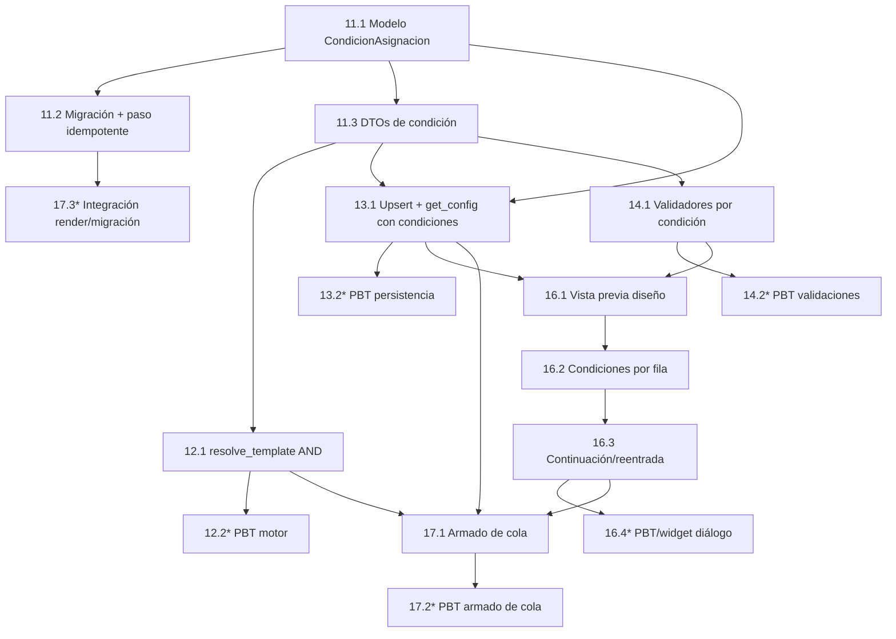

# Implementation Plan: Multiplantillaje Base

## Overview

Plan de implementación incremental para el multiplantillaje base. La primera entrega (tareas 1–10) ya está implementada en el repositorio sobre el diseño anterior: regla con un único par atributo/valor, configuración con bloqueo del set al editar y sin vista previa de diseño. Esas tareas se conservan marcadas `[x]` en la sección **Completado**.

El diseño se actualizó con tres mejoras que requieren trabajo incremental (tareas 11+ en **Trabajo pendiente**):

1. **Condiciones compuestas (AND):** una `Regla_Asignacion` pasa a tener una o más `Condicion_Asignacion` (`atributo`/`valor`) que deben cumplirse todas; el par atributo/valor deja de vivir en `ReglaAsignacion` y se mueve a un nuevo modelo `CondicionAsignacion`.
2. **Upsert único:** `save_config` actualiza la única configuración del cliente sin duplicados y `get_config` devuelve las reglas con sus condiciones; se admite configuración parcial (plantillas sin condiciones).
3. **UI enriquecida y reentrada:** vista previa del diseño base por plantilla, atributo+valor en la misma fila con agregar/quitar condiciones, y flujo de continuación/reentrada sin bloquear la selección base.

Cada tarea referencia los requisitos que cubre y, cuando aplica, las propiedades de correctitud del diseño actualizado.

## Tasks

### Completado (diseño anterior)

> Estas tareas se implementaron en la primera entrega. La numeración de Properties citada corresponde al diseño previo; las nuevas tareas (11+) usan la numeración del diseño actual.

- [x] 1. Crear los modelos de datos y registrarlos en migraciones
  - Añadir `ConfiguracionMultiplantillaje` (1:1 con Cliente, `cliente_id` único, `plantilla_default_id` FK nullable con `ondelete=SET NULL`, timestamps) y `ReglaAsignacion` (`configuracion_id`, `plantilla_destino_id`, `atributo` String(100), `valor` String(255), `orden`) en `db/models.py`, con relaciones y `cascade="all, delete-orphan"` ordenado por `orden`.
  - Importar y registrar ambos modelos en `db/migrations.py` para que `Base.metadata.create_all` los cree sin afectar tablas existentes.
  - _Requisitos: 4.1, 4.2_

- [x] 2. Definir los DTOs inmutables de transporte
  - Crear `ReglaDTO`, `ConfigDTO` (con `reglas` ordenadas y `plantillas_existentes`) y `AssignmentResult` como `@dataclass(frozen=True)` en `services/template_assignment.py`.
  - _Requisitos: 4.4, 5.5_

- [x] 3. Implementar el Motor de Asignación (función pura)
- [x] 3.1 Implementar `normalize` y `resolve_template`
  - `normalize(value)`: `str -> strip -> lower`.
  - `resolve_template(datos, config, plantilla_cola_id)`: evalúa reglas por orden ascendente, ignora reglas con atributo ausente, compara normalizado, primera coincidencia gana; trata destino inexistente como no coincidente con advertencia; fallback a default, luego a plantilla de cola, luego error con `plantilla_id=None`.
  - _Requisitos: 5.1, 5.2, 5.3, 5.4, 5.8, 8.1, 8.2, 8.3, 8.4, 8.6, 8.8_
- [x] 3.2 Pruebas PBT del Motor de Asignación
  - Un test por propiedad con Hypothesis (`@settings(max_examples=100)`), etiquetado `# Feature: multiplantillaje-base, Property N: ...`. Sin BD, sobre `ConfigDTO` generados.
  - _Requisitos: 5.1, 5.2, 5.3, 5.4, 5.8, 8.1, 8.2, 8.3, 8.4, 8.6, 8.8_

- [x] 4. Implementar el repositorio de configuración
- [x] 4.1 CRUD en `db/repositories.py`
  - `get_config`, `save_config` (reemplazo total de la config previa del cliente), `delete_config`, `list_templates(cliente_id)`.
  - _Requisitos: 2.1, 4.1, 4.2, 4.4, 6.5, 6.7_
- [x] 4.2 Implementar `available_attributes(cliente_id)`
  - Combina `Cliente.config["known_attributes"]` + claves de `Registro.datos`, sin duplicados (comparación normalizada), solo longitudes 1..100, omite vacías.
  - _Requisitos: 7.1, 7.2, 7.3_
- [x] 4.3 Pruebas PBT de persistencia y repositorio
  - Round-trip y reemplazo total, edición/eliminación parcial, rechazo de duplicados, exactamente un default válido, construcción de atributos disponibles, filtrado de `list_templates` por cliente. SQLite en memoria con modelos reales.
  - _Requisitos: 2.1, 3.7, 3.8, 4.1, 4.2, 4.4, 6.1, 6.2, 6.3, 6.5, 6.7, 7.1, 7.2, 7.3_

- [x] 5. Implementar validaciones de reglas y diferencias de plantilla
- [x] 5.1 Validadores puros
  - Longitud de atributo (1..100) y valor (1..255); rechazo de par `(atributo, valor)` duplicado (normalizado); designación de exactamente una `Plantilla_Por_Defecto`; detección de diferencia de orientación o dimensiones entre plantillas mapeadas; verificación de que la plantilla destino pertenece al mismo cliente.
  - _Requisitos: 3.1, 3.4, 3.6, 3.7, 3.8, 7.5, 8.5, 8.7_
- [x] 5.2 Pruebas PBT de validaciones
  - Rechazo de campos obligatorios vacíos, validación de longitudes, solo plantillas del mismo cliente como destino, detección de diferencias de orientación/dimensiones.
  - _Requisitos: 3.1, 3.4, 3.6, 6.4, 7.5, 8.5, 8.7_

- [x] 6. Construir el diálogo de configuración (UI)
- [x] 6.1 Estructura base de `ui/dialogs/multi_template_dialog.py`
  - `MultiTemplateDialog(QDialog)` modal que recibe `cliente_id`; carga plantillas vía repositorio; muestra el nombre de cada plantilla; maneja error de carga deshabilitando guardar.
  - _Requisitos: 2.1, 2.2, 2.5, 4.7_
- [x] 6.2 Selección de set y ventana flotante de asignación
  - Permitir seleccionar una o más plantillas; abrir la sub-vista de asignación que, por cada plantilla, pide atributo (poblado desde `available_attributes`, con entrada manual si no hay) y valor; marcar la plantilla por defecto; mostrar advertencia si solo hay una plantilla disponible.
  - _Requisitos: 2.3, 2.4, 3.1, 3.2, 3.3, 3.4, 3.5, 7.4_
- [x] 6.3 Validaciones en el guardado del diálogo
  - Rechazar reglas sin atributo/valor (conservando datos), reglas duplicadas, longitudes fuera de rango, destinos de otro cliente; mostrar advertencia de diferencias de orientación/dimensión con confirmar/cancelar; deshabilitar guardar sin al menos una plantilla destino.
  - _Requisitos: 2.5, 3.6, 3.7, 7.5, 8.5, 8.7_
- [x] 6.4 Modo edición, eliminación y persistencia
  - Cargar config existente con selección de set bloqueada; permitir editar atributo/valor/destino, cambiar default, eliminar reglas y eliminar la configuración completa; persistir vía repositorio; confirmación visible de éxito; manejo de fallo de persistencia conservando el estado en pantalla.
  - _Requisitos: 4.1, 4.3, 4.4, 4.6, 6.1, 6.2, 6.3, 6.4, 6.5, 6.6, 6.7_
- [x] 6.5 Asignación global para diseño único
  - Cuando el cliente tiene una sola plantilla, no abrir la ventana de reglas: crear/guardar configuración global con esa plantilla como default sin reglas.
  - _Requisitos: 3.8, 5.7_

- [x] 7. Integrar el botón de configuración en el Editor de Plantillas
  - Añadir un `QPushButton` con `qta.icon("fa5s.cog")` (solo icono, con tooltip) en `make_side_header` de `template_editor.py`, junto al botón de vista previa de cada lado; habilitado solo si la plantilla está guardada (tiene `cliente_id`); al activarlo abre `MultiTemplateDialog`; tooltip indicando guardar primero cuando está deshabilitado; manejo de error si el diálogo no abre.
  - _Requisitos: 1.1, 1.2, 1.3, 1.4, 1.5, 1.6_

- [x] 8. Integrar el Motor de Asignación en el flujo de impresión
- [x] 8.1 Resolver plantilla por registro en `control_panel.py` `_save_queue_and_emit`
  - Antes de crear los `ItemCola`, cargar la configuración del cliente; si existe, resolver `plantilla_id` por registro con `resolve_template` (wrapper `_resolve_plantilla_id` que traduce `AssignmentResult` y emite log de error/advertencia identificando el registro); si no existe, conservar el comportamiento actual (plantilla seleccionada para todos).
  - _Requisitos: 5.5, 5.6, 5.7, 5.8, 8.3, 8.4_
- [x] 8.2 Pruebas del armado de cola
  - PBT con SQLite en memoria: con config, cada `ItemCola` recibe la plantilla resuelta; sin config, todos reciben la plantilla de la cola.
  - _Requisitos: 5.5, 5.7_

- [x] 9. Pruebas de integración de render y migración
  - Verificar que `pdf_engine.render_queue` usa la plantilla de cada ítem y omite ítems con recursos faltantes (1–3 ejemplos); verificar que `init_database` sobre una BD con esquema previo crea las tablas nuevas sin alterar los datos existentes.
  - _Requisitos: 5.6, 5.9_

- [x] 10. Configurar dependencias y arnés de PBT
  - Añadir `hypothesis` al grupo `dev` de `pyproject.toml`; asegurar que los tests de propiedades corren con mínimo 100 iteraciones y etiquetado consistente; ejecutar la suite completa y corregir fallos.
  - _Requisitos: 5.6, 5.9_

### Trabajo pendiente (condiciones compuestas, upsert y UI)

- [x] 11. Migrar el modelo de datos a condiciones compuestas
  - [x] 11.1 Añadir el modelo `CondicionAsignacion` y reestructurar `ReglaAsignacion`
    - En `src/credencializacion/db/models.py`, crear `CondicionAsignacion` (`id`, `regla_id` FK a `reglas_asignacion` con `ondelete="CASCADE"`, `atributo` String(100), `valor` String(255), `orden` Integer) con `relationship` inversa `regla`.
    - Añadir a `ReglaAsignacion` la relación `condiciones: Mapped[list["CondicionAsignacion"]]` con `back_populates="regla"`, `cascade="all, delete-orphan"` y `order_by="CondicionAsignacion.orden"`.
    - Retirar las columnas `atributo` y `valor` de `ReglaAsignacion`, conservando `(configuracion_id, plantilla_destino_id, orden)`.
    - _Requisitos: 3.1, 3.3, 4.4_

  - [x] 11.2 Registrar el modelo nuevo y el paso de migración idempotente
    - Importar y registrar `CondicionAsignacion` en `src/credencializacion/db/migrations.py` para que `Base.metadata.create_all` cree la tabla `condiciones_asignacion`.
    - Añadir un paso de migración único e idempotente (con marca de versión de esquema, dentro de una transacción) que, en instalaciones con `reglas_asignacion` que aún tuvieran columnas `atributo`/`valor` pobladas, cree por cada regla una `CondicionAsignacion` (`regla_id`, `atributo`, `valor`, `orden=0`) y luego elimine esas columnas; no re-ejecutable.
    - _Requisitos: 4.1, 4.4_

  - [x] 11.3 Actualizar los DTOs de transporte para condiciones
    - En `src/credencializacion/services/template_assignment.py`, añadir `CondicionDTO` (`atributo`, `valor`, `orden`) como `@dataclass(frozen=True)` y cambiar `ReglaDTO` para que exponga `condiciones: tuple[CondicionDTO, ...]` (admite `()` para configuración parcial) eliminando `atributo`/`valor` directos.
    - _Requisitos: 3.1, 4.4, 9.3_

- [x] 12. Actualizar el Motor de Asignación a semántica AND
  - [x] 12.1 Reescribir `resolve_template` con conjunción de condiciones
    - En `src/credencializacion/services/template_assignment.py`, una regla coincide solo si **todas** sus `CondicionDTO` se cumplen (`normalize(datos[atributo]) == normalize(condicion.valor)`); si el registro no contiene el atributo de alguna condición, la regla no coincide; una regla con `condiciones == ()` nunca coincide. Conservar precedencia por `orden`, primera coincidencia gana, manejo de destino inexistente, fallback a default/cola y error.
    - _Requisitos: 5.1, 5.2, 5.3, 5.5, 8.1, 8.8, 9.3_

  - [x]* 12.2 Actualizar las pruebas PBT del Motor de Asignación
    - En `tests/test_template_assignment_properties.py`, actualizar generadores a reglas multi-condición (1, varias y cero condiciones) y los tests etiquetados.
    - **Property 1: Coincidencia por conjunción (AND) y precedencia determinista**
    - **Property 2: Idempotencia e invariancia de la normalización**
    - **Property 3: Fallback a la Plantilla_Por_Defecto**
    - **Property 9: Configuración parcial — reglas sin condiciones nunca coinciden**
    - **Validates: Requisitos 5.1, 5.2, 5.3, 5.5, 8.1, 8.8, 9.3**

- [x] 13. Actualizar el repositorio a upsert único con condiciones
  - [x] 13.1 Reescribir `save_config`/`get_config` para condiciones y upsert
    - En `src/credencializacion/db/repositories.py`, `save_config` debe hacer **upsert** sobre la única `ConfiguracionMultiplantillaje` del cliente (sin generar duplicados, respetando `UNIQUE(cliente_id)`) reemplazando por completo reglas y sus condiciones; aceptar reglas con `condiciones == ()` (configuración parcial). `get_config` debe devolver cada `ReglaDTO` con su tupla de `CondicionDTO` ordenada por `orden`.
    - _Requisitos: 4.1, 4.2, 4.3, 4.4, 6.5, 6.7, 9.3, 9.4, 9.6_

  - [x]* 13.2 Actualizar las pruebas PBT de persistencia
    - En `tests/test_multi_template_repository_properties.py`, ejercitar round-trip jerárquico y upsert con SQLite en memoria y la nueva `CondicionAsignacion`.
    - **Property 7: Upsert único y round-trip jerárquico de la persistencia**
    - **Property 8: Edición y eliminación parcial preservan el resto**
    - **Property 9: Configuración parcial — conservación y no coincidencia**
    - **Validates: Requisitos 4.1, 4.2, 4.3, 4.4, 4.6, 6.1, 6.2, 6.3, 6.5, 6.7, 9.3, 9.4, 9.6**

- [x] 14. Actualizar las validaciones a nivel de condición
  - [x] 14.1 Reescribir validadores por condición en `services/template_validators.py`
    - En `src/credencializacion/services/template_validators.py`, validar: longitud de `atributo` (1..100) y `valor` (1..255) por condición; rechazo de reglas con alguna condición de atributo o valor vacío (cadena vacía o solo espacios); rechazo de reglas cuyo **conjunto** de condiciones `(atributo, valor)` normalizado coincide con el de una regla existente (independiente del orden).
    - _Requisitos: 3.1, 3.4, 3.6, 3.9, 6.4, 7.5_

  - [x]* 14.2 Actualizar las pruebas PBT de validaciones
    - En `tests/test_template_validators_properties.py`, actualizar generadores a reglas con condiciones.
    - **Property 10: Rechazo de reglas con condiciones de campos obligatorios vacíos**
    - **Property 11: Validación de longitud de atributo y valor por condición**
    - **Property 12: Rechazo de reglas con conjunto de condiciones duplicado**
    - **Validates: Requisitos 3.1, 3.4, 3.6, 3.9, 6.4, 7.5**

- [x] 15. Checkpoint - Núcleo (datos, motor, repo, validaciones)
  - Asegurar que todas las pruebas pasan; preguntar al usuario si surgen dudas.

- [x] 16. Actualizar el diálogo de configuración (UI)
  - [x] 16.1 Vista previa del diseño base por plantilla
    - En `src/credencializacion/ui/dialogs/multi_template_dialog.py`, mostrar la `Vista_Previa_Diseno` de cada plantilla seleccionada usando la imagen de fondo de `Plantilla.recursos` (`fondo_frente`/`fondo_vuelta`), con un indicador de "vista previa no disponible" cuando no haya imagen, permitiendo continuar la configuración.
    - _Requisitos: 2.3, 2.4_

  - [x] 16.2 Atributo y valor en la misma fila con agregar/quitar condiciones
    - En `multi_template_dialog.py`, presentar el atributo (selector desde `available_attributes` o entrada manual) y el valor de cada condición en la misma fila de la plantilla destino; permitir agregar y quitar condiciones (AND) por plantilla, manteniendo al menos una condición por regla; representar la regla como "atributo igual a valor [Y atributo igual a valor]...".
    - _Requisitos: 3.1, 3.2, 3.3, 3.7_

  - [x] 16.3 Flujo de continuación y reentrada (sin bloqueo del set)
    - En `multi_template_dialog.py`, no bloquear la selección base hasta guardar; cerrar sin guardar descarta cambios y permite reelegir el set en la siguiente apertura; soportar guardar configuración parcial (plantillas sin condiciones) y completarla luego al reabrir desde el engranaje, con indicación visual de las plantillas que aún no tienen condiciones.
    - _Requisitos: 9.1, 9.2, 9.3, 9.4, 9.5, 9.6_

  - [ ]* 16.4 Actualizar las pruebas de widget del diálogo
    - En `tests/test_multi_template_dialog.py`, cubrir vista previa/indicador sin imagen, condiciones por fila (agregar/quitar), indicación de plantillas sin condiciones y reelección del set tras cerrar sin guardar.
    - _Requisitos: 2.3, 2.4, 3.3, 9.1, 9.2, 9.5_

- [x] 17. Integrar el flujo de impresión y la cobertura de integración
  - [x] 17.1 Ajustar el armado de cola al nuevo `ConfigDTO`
    - En `src/credencializacion/ui/pages/control_panel.py`, verificar y ajustar `_save_queue_and_emit` y `_resolve_plantilla_id` para operar con el `ConfigDTO` que ahora trae reglas con condiciones; sin configuración, conservar el comportamiento mono-plantilla actual.
    - _Requisitos: 5.6, 5.8_

  - [x]* 17.2 Actualizar la prueba PBT del armado de cola
    - En `tests/test_control_panel_queue_assembly_properties.py`, regenerar configuraciones con reglas multi-condición.
    - **Property 18: El armado de cola asigna la plantilla resuelta por ítem**
    - **Validates: Requisitos 5.6, 5.8**

  - [x]* 17.3 Actualizar las pruebas de integración de render y migración
    - En `tests/test_render_and_migration_integration.py`, verificar que `render_queue` usa la plantilla de cada ítem y omite ítems con recursos faltantes, y que el paso de migración idempotente convierte reglas simples previas en regla+1 condición sin alterar otros datos.
    - _Requisitos: 4.1, 5.6_

- [x] 18. Checkpoint final - Ejecutar la suite completa
  - Ejecutar toda la suite (incluidas las PBT con mínimo 100 iteraciones) y corregir fallos; asegurar que todas las pruebas pasan, preguntar al usuario si surgen dudas.

## Task Dependency Graph



```json
{
  "waves": [
    {
      "wave": 1,
      "tasks": ["11.1"],
      "description": "Modelo CondicionAsignacion y reestructuración de ReglaAsignacion (db/models.py)."
    },
    {
      "wave": 2,
      "tasks": ["11.2", "11.3"],
      "description": "Registro/migración del modelo (db/migrations.py) y DTOs de condición (services/template_assignment.py); ambos dependen del modelo."
    },
    {
      "wave": 3,
      "tasks": ["12.1", "13.1", "14.1"],
      "description": "Núcleo sobre los DTOs: motor AND (template_assignment.py), upsert/get_config (repositories.py) y validadores por condición (template_validators.py)."
    },
    {
      "wave": 4,
      "tasks": ["12.2", "13.2", "14.2", "16.1"],
      "description": "PBT del núcleo (motor, persistencia, validaciones) y vista previa del diseño en el diálogo (archivo de diálogo, sin conflicto con los tests)."
    },
    {
      "wave": 5,
      "tasks": ["16.2"],
      "description": "Condiciones atributo+valor por fila con agregar/quitar (multi_template_dialog.py, mismo archivo que 16.1)."
    },
    {
      "wave": 6,
      "tasks": ["16.3"],
      "description": "Flujo de continuación/reentrada sin bloqueo del set (multi_template_dialog.py, mismo archivo que 16.2)."
    },
    {
      "wave": 7,
      "tasks": ["16.4", "17.1"],
      "description": "Pruebas de widget del diálogo e integración del armado de cola con el nuevo ConfigDTO (control_panel.py)."
    },
    {
      "wave": 8,
      "tasks": ["17.2", "17.3"],
      "description": "PBT del armado de cola e integración de render/migración (dependen de 17.1 y de la migración 11.2)."
    }
  ]
}
```

## Notes

- Las tareas 1–10 (sección **Completado**) ya están implementadas sobre el diseño anterior; las tareas 11+ evolucionan ese código en lugar de recrearlo.
- Tareas marcadas con `*` son opcionales (pruebas) y pueden omitirse para un MVP más rápido; no deben implementarse automáticamente.
- El cambio central es estructural: `atributo`/`valor` migran de `ReglaAsignacion` a `CondicionAsignacion` (1:N, AND). Una regla con una sola condición reproduce la semántica simple anterior, preservando compatibilidad.
- `init_database` crea la tabla `condiciones_asignacion` vía `create_all`; el paso de migración idempotente (11.2) solo actúa en instalaciones de prueba con el esquema previo poblado y no se re-ejecuta.
- Una `ReglaDTO` con `condiciones == ()` modela una plantilla seleccionada sin condiciones (configuración parcial): se persiste y se conserva al reabrir, pero el Motor_Asignacion nunca la hace coincidir (Property 9).
- Las PBT usan Hypothesis (mínimo 100 iteraciones por propiedad) y SQLite en memoria para los round-trips de persistencia, etiquetadas `# Feature: multiplantillaje-base, Property N`. La numeración de Properties citada en las tareas 11+ corresponde al diseño actualizado (18 propiedades).
- Sin configuración de multiplantillaje, el flujo conserva el comportamiento mono-plantilla actual (Requisito 5.8), validado por Property 18.
